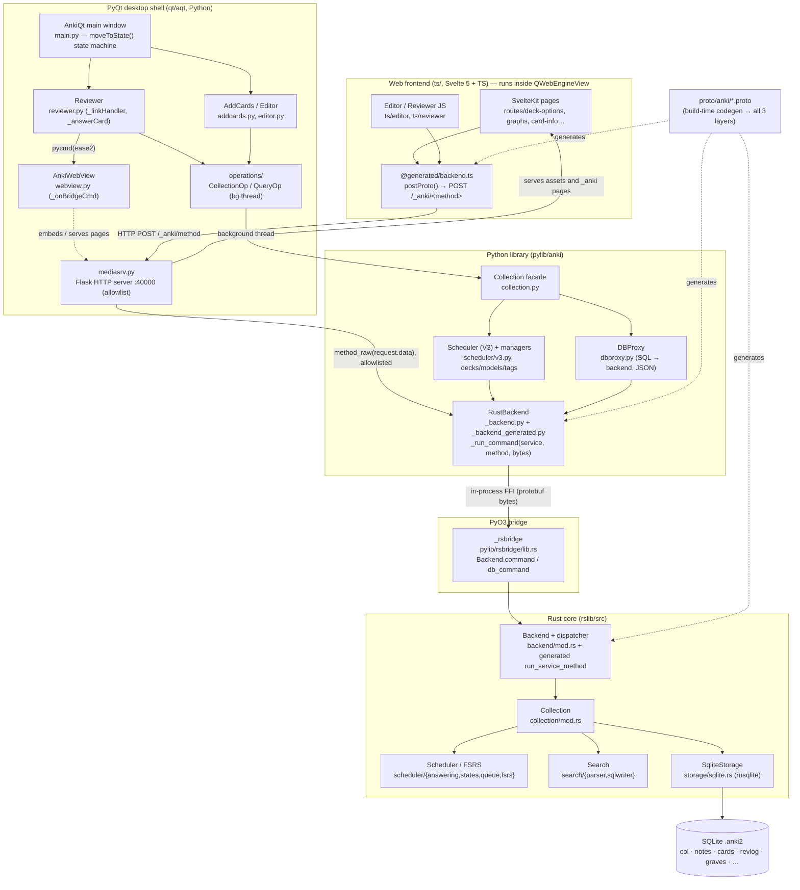

# Anki Desktop — Architecture (Authoritative)

> Consolidated, code-verified architecture overview of the Anki desktop repo.
> This document supersedes `ARCHITECTURE_NOTES_1.md` (“Doc A”) and
> `ARCHITECTURE_NOTES_2.md` (“Doc B”). **Every non-trivial claim was checked
> against the source in this checkout**; file:symbol citations are given inline.
> Where the two prior docs disagreed, the conflict and its evidence are recorded
> in the **Reconciliation Log** at the end. Anything that could not be confirmed
> is listed under **Unverified / Uncertain** and labelled as such.

---

## 1. High-Level Architecture

Anki is a **polyglot monorepo** with one authoritative core written in Rust and
two front-ends that sit on top of it: a PyQt desktop shell, and a Svelte/TypeScript
web UI embedded inside that shell. **Protobuf is the contract** that ties all three
languages together; it is code-generated into each at build time.

| Layer | Lives in | Language | Responsibility |
|---|---|---|---|
| **Rust core** (`anki` crate) | `rslib/` | Rust | All real logic: collection lifecycle, data model, scheduler/FSRS, search, templates/rendering, media, sync, import/export, undo. **Owns the only SQLite connection.** |
| **PyO3 bridge** | `pylib/rsbridge/lib.rs` | Rust + PyO3 | In-process FFI exposing the Rust `Backend` to Python as the native module `_rsbridge`. |
| **Python library** (`anki`) | `pylib/anki/` | Python | Thin, ergonomic facade over the backend (`Collection`, `Card`, `Note`, managers). Also the legacy/add-on compatibility surface. No scheduling logic of its own. |
| **PyQt GUI** (`aqt`) | `qt/aqt/` | Python + PyQt6/QtWebEngine | Desktop window + screen state machine, dialogs, reviewer/editor, add-on host. Embeds the web views and runs the local HTTP server. |
| **Web frontend** | `ts/` | Svelte 5 + TS + Vite | Rich UI pages (deck options, graphs, card-info, editor, reviewer rendering, importers) rendered inside `QWebEngineView`. |
| **Local HTTP server** | `qt/aqt/mediasrv.py` | Python (**Flask**) | Serves web assets + media to the embedded browser and forwards allow-listed protobuf RPCs from JS into the Rust backend. |
| **Protobuf contract** | `proto/anki/*.proto` | proto3 | Defines every cross-language RPC + message (and some stored data). Codegen feeds Rust, Python, TS. |
| **Build system** | `build/`, `justfile`, `./ninja`, `./run` | Rust + ninja | A Rust “runner” executes a generated `build.ninja`; the graph is produced by a Rust configure step. Downloads pinned toolchains (protoc, node, uv) and orchestrates all codegen + builds. |

### Three cross-language channels (they are *not* the same)

These are the central mental model. There are **three** distinct paths:

1. **Python → Rust — in-process PyO3 FFI.**
   `_rsbridge.Backend.command(service: u32, method: u32, input: bytes) -> bytes`
   (`pylib/rsbridge/lib.rs:49`). Binary protobuf in, binary protobuf out; no
   network. The GIL is released during the call via `py.detach()`
   (`pylib/rsbridge/lib.rs:57`). A **separate** `db_command(bytes)` path
   (`lib.rs:67`) carries raw SQL as **JSON** rather than protobuf, “due to Python's
   slow protobuf encoding/decoding” (comment at `lib.rs:65`).

2. **JS → Rust — HTTP POST, *through* Python.**
   A Svelte page calls a generated async fn → `postProto(method, …)` which does
   `fetch("/_anki/<method>", { method: "POST", "Content-Type": "application/binary", body })`
   (`ts/lib/generated/post.ts:17,31,33`). The request hits the **Python Flask**
   `mediasrv` (`qt/aqt/mediasrv.py:47`, `app = flask.Flask(...)`), whose catch-all
   route (`mediasrv.py:381`) dispatches to
   `raw_backend_request(endpoint) = lambda: getattr(aqt.mw.col._backend, f"{endpoint}_raw")(request.data)`
   (`mediasrv.py:771`) — i.e. it pipes the raw protobuf bytes straight into channel 1.
   **The HTTP layer keys on the RPC *name string*** (`/_anki/answerCard`), not on the
   numeric indices used internally. **Only allow-listed methods are reachable** (see §5).

3. **JS → Python — `pycmd` Qt WebChannel bridge.**
   Qt-hosted pages (reviewer, deck browser) call `pycmd("…")`. This reaches
   `AnkiWebView._onBridgeCmd` (`qt/aqt/webview.py`), which fires
   `gui_hooks.webview_did_receive_js_message` (`webview.py:803`) and then calls the
   page’s registered bridge handler. Used for UI actions Python must coordinate
   (e.g. committing a card answer in the desktop reviewer).



---

## 2. Tech Stack — what each piece is for

- **Rust core (`rslib/`)** — single source of truth so the desktop, mobile
  (AnkiDroid/iOS share the core via FFI; see `rslib/src/ankidroid/`), and the sync
  server stay consistent. Fast, memory-safe, owns the DB.
- **SQLite via `rusqlite`** (`rslib/src/storage/sqlite.rs`) — the collection is a
  single `.anki2` file. Custom SQL functions are registered on the connection:
  `field_at_index`, `regexp` (+ variants), `process_text`, `fnvhash`
  (`storage/sqlite.rs`). Rust holds the **only** connection.
- **PyO3 (`pylib/rsbridge`)** — lets CPython call the Rust core in-process (no IPC),
  passing protobuf bytes; keeps the mature Python/PyQt GUI ecosystem driving the
  new core.
- **Python (`pylib/` + `qt/`)** — PyQt6 is the cross-platform desktop toolkit;
  Python is the historical add-on language, so a large ecosystem depends on the
  `anki.*`/`aqt.*` APIs (hence the heavy deprecation-compat machinery, §8).
- **Svelte 5 + SvelteKit + Vite (`ts/`)** — reactive UI for complex screens
  (deck options, stats graphs, editor) rendered in an embedded Chromium
  (`QWebEngineView`). (`svelte ^5`, `@sveltejs/kit ^2` in `package.json`.)
- **Protobuf (`proto/anki/`)** — one schema generates type-safe bindings for Rust,
  Python, and TS so all three layers agree on every message and RPC.
- **FSRS** (`fsrs` crate; integration in `rslib/src/scheduler/fsrs/`) — the modern
  spaced-repetition algorithm (memory stability/difficulty), layered on top of the
  legacy SM-2 ease model.
- **Fluent (`ftl/`, `rslib/i18n`)** — translations; codegen produces type-safe i18n
  accessors for each language (see §7). Edit `ftl/core` (or `ftl/qt` for Qt-only).

---

## 3. Entry Points & the modules you'll touch most

### App startup (dev)

```
just run
  └─ ./run                       # bash: exports ANKIDEV=1, ANKI_API_PORT=40000,
     │                           #       ANKI_API_HOST=127.0.0.1,
     │                           #       QTWEBENGINE_REMOTE_DEBUGGING=8080
     ├─ ./ninja pylib qt         # build via the Rust runner → build.ninja
     └─ out/pyenv/bin/python tools/run.py
          └─ import aqt; aqt.run()           # tools/run.py:9-12
               └─ aqt/__init__.py: run() (:573) → _run() (:586)
                    ├─ ProfileManager(...)            # __init__.py:647
                    ├─ AnkiApp(argv)                  # __init__.py:682
                    └─ AnkiQt(app, pm, backend, …)    # __init__.py:780  → qt/aqt/main.py
                         └─ loadProfile → loadCollection → _loadCollection
                              └─ self.col = Collection(path, backend=…)   # opens Rust collection
                              └─ moveToState("deckBrowser")
```

- `tools/run.py` is the **dev** entry invoked by `./run` (verified: `run:20`).
- `qt/runanki.py` is the **packaged/installed** launcher (with `bazelfixes`, gated by
  `ANKI_IMPORT_ONLY`). Both ultimately call `aqt.run()`.

### Main window & screen state machine — `qt/aqt/main.py:AnkiQt`
`moveToState(...)` (`main.py:758`) cycles a set of states defined at `main.py:86`:
`["startup", "deckBrowser", "overview", "review", "resetRequired", "profileManager"]`,
with handlers `_deckBrowserState` (`:772`), `_overviewState` (`:782`),
`_reviewState` (`:787`), `_resetRequiredState` (`:912`).

### Rust collection construction — `rslib/src/collection/mod.rs`
`CollectionBuilder` → `Collection` (holds `storage: SqliteStorage`, `tr: I18n`,
undo/queue state).

### Modules you'll most likely edit
- **Scheduling / review behavior:** `rslib/src/scheduler/answering/`,
  `rslib/src/scheduler/states/`, `rslib/src/scheduler/queue/`, `rslib/src/scheduler/fsrs/`.
- **Note/card creation & card generation:** `rslib/src/notes/mod.rs`,
  `rslib/src/notetype/mod.rs`.
- **Search syntax → SQL:** `rslib/src/search/parser.rs`, `rslib/src/search/sqlwriter.rs`.
- **Card rendering/templates:** `rslib/src/template.rs`, `template_filters.rs`,
  `rslib/src/card_rendering/`.
- **DB schema & persistence:** `rslib/src/storage/**`, `storage/schema11.sql`,
  `storage/upgrades/`.
- **The API surface:** add/modify an RPC in `proto/anki/*.proto`, implement it in the
  matching `rslib/src/<domain>/service*.rs`.
- **Desktop UI:** `qt/aqt/main.py`, `qt/aqt/reviewer.py`, `qt/aqt/editor.py`,
  `qt/aqt/addcards.py`, `qt/aqt/browser/`, `qt/aqt/operations/`.
- **Web UI:** `ts/routes/**`, `ts/lib/components/`, `ts/editor/`, `ts/reviewer/`.

---

## 4. Data Model

### ID newtypes — `rslib/src/types.rs`
Created via the `define_newtype!` macro (`types.rs:5`). `CardId`, `NoteId`, `DeckId`,
`NotetypeId`, `DeckConfigId`, `RevlogId` wrap **`i64`** (ms timestamps).
**`Usn`** (update-sequence number, for sync) wraps **`i32`** — `define_newtype!(Usn, i32)`
(`types.rs:70`). *(Both prior docs incorrectly grouped `Usn` with the `i64` IDs.)*

### Card — `rslib/src/card/mod.rs` (`struct Card`, line 76)
Fields: `note_id`, `deck_id`, `template_idx: u16`, `ctype: CardType`, `queue: CardQueue`,
`due: i32` (`:85`), `interval`, `ease_factor: u16` (`:87`), `reps`, `lapses`,
`remaining_steps`, `original_due: i32` (`:91`) / `original_deck_id` (filtered decks),
plus FSRS fields `memory_state: Option<FsrsMemoryState>` (`stability`, `difficulty`),
`desired_retention`, `decay`, `last_review_time`, and `custom_data: String` (JSON,
exposed to the reviewer for add-on state).

- `ease_factor` is stored as a **permille integer**: `Card::ease_factor()` returns
  `self.ease_factor as f32 / 1000.0` (`card/mod.rs:223-224`), so `2500` = ease `2.5`
  = 250%. The default starting factor is `2500` (Python `consts.STARTING_FACTOR = 2500`,
  `consts.py:74`).
- **`CardType`** (`consts.py:35-38`, mirrored in Rust): `New=0, Learn=1, Review=2,
  Relearn=3`.
- **`CardQueue`**: `New=0, Learn=1, Review=2, DayLearn=3, PreviewRepeat=4`, plus negative
  `Suspended=-1, SchedBuried=-2, UserBuried=-3`.
- `due`’s meaning depends on `queue` (position for New, unix-seconds for Learn,
  days-since-creation for Review) — see the `CardQueue` doc comments in `card/mod.rs`.
- FSRS state + `custom_data` are persisted inside the `cards.data` JSON column, not as
  separate SQL columns: see `CardData` in `rslib/src/storage/card/data.rs`
  (`fsrs_stability`/`fsrs_difficulty` serialized as `"s"`/`"d"`).

### Note — `rslib/src/notes/mod.rs` (`struct Note`)
`id`, `guid` (base91, via `base91_u64`), `notetype_id`, `tags: Vec<String>`,
`fields: Vec<String>` (joined with `\x1f` in the DB), `mtime`, `usn`, plus cached
`sort_field` and `checksum`. The cache + normalization is computed in
`prepare_for_update`; the checksum drives duplicate detection (`ix_notes_csum` on
`notes.csum`).

### Deck — `rslib/src/decks/mod.rs` (`struct Deck`)
`id`, `name: NativeDeckName` (hierarchy via `::`), `kind: DeckKind` =
`Normal(NormalDeck { config_id, … })` or `Filtered(FilteredDeck { … })`.

### DeckConfig — `rslib/src/deckconfig/mod.rs` (`struct DeckConfig`, line 32)
Wraps `inner: DeckConfigInner` (`:37`), which is the protobuf type
`anki_proto::deck_config::deck_config::Config` (`deckconfig/mod.rs:17`): learn/relearn
steps, daily limits, ease/interval multipliers, leech threshold, FSRS params +
`desired_retention`.

### Notetype — `rslib/src/notetype/mod.rs` (`struct Notetype`)
`fields: Vec<NoteField>`, `templates: Vec<CardTemplate>` (front/back templates),
`config` (`NotetypeConfig`: sort field idx, CSS/LaTeX, card-generation requirements).
This is what turns one note into N cards.

### Review log — `rslib/src/revlog/mod.rs` (`struct RevlogEntry`)
One row per answer: `id` (ms timestamp), `cid`, `usn`, `button_chosen` (1–4),
`interval`, `last_interval`, `ease_factor: u32` (`:54`), `taken_millis`,
`review_kind: RevlogReviewKind` (`:65`): `Learning=0, Review=1, Relearning=2,
Filtered=3, Manual=4, Rescheduled=5`. The revlog `ease_factor` is populated from the
card’s ease factor (`revlog/mod.rs:162-165`) and uses the **same permille scale**
(`2500` = 250%); the only difference from `Card.ease_factor` is the storage type
(`u32` vs `u16`).

### Scheduling state machine — `rslib/src/scheduler/states/`
`CardState` = `Normal(NormalState)` | `Filtered(FilteredState)`, where
`NormalState` ∈ {New, Learning, Review, Relearning}. State is *derived* from the `Card`
row, transitioned on answer, then written back.

### Storage / SQLite tables — `rslib/src/storage/schema11.sql`
Base schema columns (schema11):
- **`col`** (single row): `id, crt, mod, scm, ver, dty, usn, ls`, plus JSON blobs
  `conf, models, decks, dconf, tags`. *(Note types/decks historically lived in these
  JSON blobs; modern code reads them via dedicated tables but the columns persist for
  compat/downgrade.)*
- **`notes`**: `id, guid, mid, mod, usn, tags, flds` (fields joined by `\x1f`), `sfld`
  (sort field), `csum` (checksum), `flags, data`.
- **`cards`**: `id, nid, did, ord` (template index), `mod, usn, type, queue, due, ivl,
  factor, reps, lapses, left, odue, odid, flags, data` (`data` is JSON holding FSRS
  state + `custom_data`).
- **`revlog`**: `id, cid, usn, ease, ivl, lastIvl, factor, time, type`.
- **`graves`**: `usn, oid, type` (tombstones for sync).
- Indexes: `ix_cards_sched ON cards(did, queue, due)` (the scheduling hot path;
  `schema11.sql:74`) and `ix_notes_csum ON notes(csum)` (`:78`).

Migrations live in `rslib/src/storage/upgrades/` (schema14/15/17/18); the current
maximum is **v18** (`storage/upgrades/mod.rs:9`, `SCHEMA_MAX_VERSION: u8 = 18`), with
v11 retained as the base/downgrade target. The later schemas split the old JSON blobs
out into real tables (`notetypes`, `fields`, `templates`, `decks`, `deck_config`,
`config`, `tags`).

**Python mirrors** of these types (`pylib/anki/cards.py:Card`, `notes.py:Note`,
`models.py:ModelManager`, `decks.py:DeckManager`) are thin wrappers around the protobuf
messages; constants live in `pylib/anki/consts.py` (`CARD_TYPE_*`, `QUEUE_TYPE_*`,
`REVLOG_*`, `STARTING_FACTOR = 2500`).

---

## 5. Inter-Layer Communication (the protobuf/FFI boundary)

### The contract — `proto/anki/*.proto` (25 files)
Files: `ankidroid, ankihub, ankiweb, backend, card_rendering, cards, collection,
config, deck_config, decks, frontend, generic, github, i18n, image_occlusion,
import_export, links, media, notes, notetypes, scheduler, search, stats, sync, tags`.

Most domains define **two** services: `XxxService` (collection-bound methods) and
`BackendXxxService` (methods that don’t need an open collection). Example
(`proto/anki/scheduler.proto`): `service SchedulerService` (`:17`) and
`service BackendSchedulerService` (`:71`). Representative RPCs:
- `AnswerCard(CardAnswer) returns (collection.OpChanges)` (`scheduler.proto:19`)
- `GetQueuedCards(GetQueuedCardsRequest) returns (QueuedCards)` (`:18`)
- `ComputeFsrsParams(ComputeFsrsParamsRequest) returns (ComputeFsrsParamsResponse)` (`:50-51`)
- `AddNote(AddNoteRequest) returns (AddNoteResponse)` (`notes.proto:17`), where
  `AddNoteResponse { collection.OpChangesWithCount changes = 1; int64 note_id = 2; }`
  (`notes.proto:61-64`).

Most **mutating** RPCs return `collection.OpChanges` (a bitmask of which UI areas
changed) — this drives client refresh.

### Build-time codegen — one schema → three languages
Codegen is split across two Rust build crates:
- **`anki_proto`** (`rslib/proto/`, `Cargo.toml:2`) — its `build.rs` (`rslib/proto/build.rs`)
  compiles the protos with **prost** (`prost-build`, `rust.rs:23`) and emits the
  Python and TypeScript interfaces (`python::write_python_interface`,
  `typescript::write_ts_interface`, called from `build.rs:17-18`).
- **`anki_proto_gen`** (`rslib/proto_gen/`, `Cargo.toml:2`) — reads the descriptor pool
  and produces the `(CollectionService, BackendService)` lists via `get_services()`
  (`proto_gen/src/lib.rs:46`).

Generated outputs:
- **Rust:** `rslib/rust_interface.rs:write_rust_interface()` (`:19`) renders the service
  traits and the top-level dispatcher, writing them to `$OUT_DIR/backend.rs`
  (`rust_interface.rs:39-41`). That file is `include!`’d into the crate by
  `rslib/src/services.rs:9` (`include!(concat!(env!("OUT_DIR"), "/backend.rs"))`).
  The dispatcher signature is
  `run_service_method(&self, service: u32, method: u32, input: &[u8]) -> Result<Vec<u8>, Vec<u8>>`
  (`rust_interface.rs:139`), which `match`es on `service`, then `method`. The `Backend`
  struct itself lives in `rslib/src/backend/mod.rs`. Message structs come from prost.
- **Python:** `out/pylib/anki/_backend_generated.py:RustBackendGenerated` — for every RPC
  a `foo_raw(bytes) -> bytes` and a typed `foo(**kwargs) -> Msg`, **both** calling
  `_run_command(service_idx, method_idx, bytes)`. Message types are `*_pb2.py`.
- **TypeScript:** `out/ts/lib/generated/backend.ts` — **226** generated `async`
  functions (e.g. `answerCard`, `getCard`, `getQueuedCards`) using `@bufbuild/protobuf`
  messages, each calling `postProto("<methodName>", …)`. Messages via
  `@bufbuild/protoc-gen-es` into `out/ts/lib/generated/anki/*_pb`.

### Service / method indices — **stable & deterministic**
A call is a **(service_index, method_index, bytes)** triple on the FFI path. The
indices are taken directly from the protobuf descriptor: in `anki_proto_gen`,
`CollectionService`/`BackendService` set `index: service.index()` and each `Method` sets
`index: method.index()` (`proto_gen/src/lib.rs:129,140,159`). The codegen explicitly
documents that these must be consistent across languages and that clients must use the
`.index` fields from `get_services()` (`proto_gen/src/lib.rs:39-42`).

Concretely, the generated Python hard-codes them (verified in
`out/pylib/anki/_backend_generated.py`):
- `answer_card_raw` → `self._run_command(13, 4, message)` → **SchedulerService = 13,
  AnswerCard = 4**.
- `add_note_raw` → `self._run_command(25, 1, message)` → **NotesService = 25,
  AddNote = 1**.

These are **deterministic** (a function of the proto descriptor order, not random per
build), so they are identical across builds of the same `.proto` set. They are still
**positional**: inserting/reordering services or methods shifts them — which is exactly
why client code references them only through codegen and never hand-writes them, and why
proto changes must rebuild all languages together (see §8). **Note:** the HTTP/JS path
(channel 2) does *not* use these numbers — it dispatches by the RPC name string
(`/_anki/answerCard`); the numeric indices are an FFI-path detail.

### Runtime path 1 — Python ↔ Rust (in-process, PyO3)
`pylib/rsbridge/lib.rs`: `#[pyclass] Backend` (`:14`) with `open_backend(bytes) -> Backend`
(`:39`), `command(service, method, input) -> bytes` (`:49`, releases GIL via `py.detach()`),
`db_command(bytes)` (`:67`, JSON), and `buildhash()` (`:21`).

Chain: `Collection.foo()` (`collection.py`) → `self._backend.foo()`
(`RustBackendGenerated`) → `_run_command(svc, mthd, bytes)` (`pylib/anki/_backend.py:159`)
→ `_rsbridge.Backend.command(...)` (`_backend.py:162`) → Rust `run_service_method` → trait
impl on `Collection`/`Backend`. `RustBackend` (`_backend.py:58`) maps `BackendError`
kinds to Python exceptions (`pylib/anki/errors.py`).

> **Even raw SQL from Python goes through Rust.** `col.db` is a `DBProxy`
> (`pylib/anki/dbproxy.py:24`); `execute`/`all`/`scalar` round-trip through
> `self._backend.db_query(...)` / `db_execute_many(...)` (`dbproxy.py:66,105`). Python
> never opens its own SQLite handle — Rust owns the single connection.

### Runtime path 2 — TypeScript ↔ Rust (HTTP, via Python Flask)
`postProto()` (`ts/lib/generated/post.ts`, copied to `out/ts/lib/generated/post.ts`)
serializes the request and `fetch("/_anki/<method>", { method: "POST",
"Content-Type": "application/binary", body })`. In dev, `ts/vite.config.ts:40-46`
proxies `/_anki` → `http://127.0.0.1:40000`.

The server is the **Flask** app in `qt/aqt/mediasrv.py` (`app = flask.Flask(...)`,
`:47`; catch-all route `@app.route("/<path:pathin>", …)` at `:381`). For backend RPCs it
builds a handler map (`mediasrv.py:781`) from two allowlists and calls
`raw_backend_request(endpoint)` → `getattr(aqt.mw.col._backend, f"{endpoint}_raw")(request.data)`
(`:771`). **Allowlist (important):** only methods named in
`mediasrv.py:exposed_backend_list` (`:726`) — plus the custom handlers in
`post_handler_list` (`:707`) — are reachable over HTTP. The web frontend does **not**
have blanket access to every RPC; most of the hundreds of protobuf RPCs are unreachable
from the browser.

### Runtime path 3 — JS → Python UI bridge (`pycmd`)
For Qt-hosted pages, `qt/aqt/webview.py` injects a `QWebChannel` bridge. JS `pycmd("…")`
→ `AnkiWebView._onBridgeCmd` fires `gui_hooks.webview_did_receive_js_message`
(`webview.py:803`) and then calls the handler registered via
`set_bridge_command(func, context)` (`webview.py:831`). For the reviewer that handler is
`Reviewer._linkHandler` (registered at `reviewer.py:180`).

---

## 6. Two features traced end-to-end

### A. Answer a card (desktop reviewer)
1. **JS:** the reviewer page renders ease buttons with
   `onclick='pycmd("ease%d");'` (`qt/aqt/reviewer.py:931-940`) → e.g. `pycmd("ease2")`.
2. **Qt bridge:** `AnkiWebView._onBridgeCmd` (fires
   `gui_hooks.webview_did_receive_js_message`, `webview.py:803`) → the registered handler
   `Reviewer._linkHandler("ease2")` (`reviewer.py:675`), which does
   `val = int(url[4:]); self._answerCard(val)` (`reviewer.py:680`).
3. **Build the answer & run off the UI thread:** `_answerCard` builds a `CardAnswer`
   (next states come from the scheduler; `col.sched.build_answer`,
   `pylib/anki/scheduler/v3.py:66`) and runs it through the operations framework:
   `qt/aqt/operations/scheduling.py:answer_card(...)` → `CollectionOp(...,
   lambda col: col.sched.answer_card(answer))` (`operations/scheduling.py:284`) →
   `.run_in_background()` via `mw.taskman` (`operations/__init__.py:99,283`).
4. **Python facade:** `Scheduler.answer_card` (`pylib/anki/scheduler/v3.py:94`) →
   `col._backend.answer_card_raw(bytes)` → `_run_command(13, 4, …)`.
5. **PyO3:** `_rsbridge.Backend.command(13, 4, bytes)` → `Backend::run_service_method`.
6. **Rust service:** `SchedulerService::answer_card` is implemented in
   `rslib/src/scheduler/service/mod.rs` (around `:34`), which converts the proto and calls
   `Collection::answer_card` (`rslib/src/scheduler/answering/mod.rs:311`).
7. **Rust core:** `Collection::transact(Op::AnswerCard, |col| col.answer_card_inner(answer))`
   (`answering/mod.rs:315`; the transaction + undo step is set up in
   `rslib/src/collection/transact.rs`). Inside `answer_card_inner`:
   - load the card (`storage.get_card`), build a `CardStateUpdater`;
   - `require!` that the client’s `current_state` matches the freshly computed state
     (optimistic concurrency — detects stale clients);
   - `apply_study_state(current, new)` dispatches into the per-state files under
     `scheduler/answering/` (e.g. `learning.rs`, `review.rs`), consulting FSRS
     (`scheduler/fsrs/`) when enabled, and produces a partial revlog;
   - `add_partial_revlog` → `storage.add_revlog_entry` (INSERT `revlog`);
   - update deck stats, bury siblings if configured, then `update_card_inner` →
     `storage.update_card` (UPDATE `cards`); add a leech tag if the new state leeched.
8. **Return:** `OpChanges` bubbles back up; the `CollectionOp` success callback fires
   `gui_hooks.operation_did_execute`, the reviewer refreshes and loads the next card.

> The Svelte reviewer’s `ts/reviewer/answering.ts` (`getSchedulingStatesWithContext` /
> `setSchedulingStates`, via `postProto`) is used to *compute/preview* next states and to
> let add-ons mutate them (see §8). The desktop **commit** goes through the Python `pycmd`
> path above, not `postProto`.

### B. Add a note (Add Cards dialog)
1. **UI:** `qt/aqt/addcards.py:AddCards.add_current_note()` reads the note from
   `qt/aqt/editor.py:Editor` and the target deck from `DeckChooser`.
2. **Operation:** `qt/aqt/operations/note.py:add_note(...)` (`:16`) →
   `CollectionOp(parent, lambda col: col.add_note(note, target_deck_id))` → background thread.
3. **Python facade:** `pylib/anki/collection.py:Collection.add_note` (`:532`) fires
   `hooks.note_will_be_added`, then `self._backend.add_note(note=note._to_backend_note(),
   deck_id=…)` → `_run_command(25, 1, …)`; sets `note.id` from the response.
4. **PyO3 → Rust:** `Backend::run_service_method` → `NotesService::add_note` →
   `Collection::add_note` (`rslib/src/notes/mod.rs:90`) →
   `transact(Op::AddNote, |col| col.add_note_inner(note, did))`.
5. **Rust core (`notes/mod.rs`):** load the notetype; `canonify_note_tags`;
   `note.prepare_for_update` (normalize fields, compute `sort_field` + `checksum`);
   `storage.add_note` (INSERT + `last_insert_rowid`); **generate cards** for each matching
   template (card generation around `notes/mod.rs:375`) → `storage.add_card`; record an
   undo step; bump `usn`.
6. **Return:** `AddNoteResponse` (`OpChangesWithCount` + `note_id`); the dialog resets for
   the next note; `OpChanges` triggers UI refresh.

---

## 7. Build & Dev Workflow

> Per `CLAUDE.md`: use **`just`** recipes; don’t call `./ninja`/`./run`/`tools/*` directly.

**Build system layout** (`build/`):
- **`build/runner/`** — the Rust binary that **executes** build steps (archive, build,
  pyenv, yarn, rsync, run; `build/runner/src/main.rs:32-46`). `./ninja` builds and uses it.
- **`build/ninja_gen/`** — the Rust **library that generates** the `build.ninja` graph
  (modules for protobuf, cargo, copy, etc.). The protoc version is pinned to **v31.1**
  (`build/ninja_gen/src/protobuf.rs`).
- **`build/configure/`** — the Rust configure step that drives `ninja_gen` to produce the
  graph.

| Command | What it does |
|---|---|
| `just run` | Build `pylib`+`qt` and launch Anki in dev mode (`ANKIDEV=1`; pages at `http://localhost:40000/_anki/pages/`, e.g. `deckconfig.html`; Qt remote debugging on `:8080`). |
| `just run-optimized` | Same, release-optimized. |
| `just check` | Format + full build + all lints/tests (run before marking work done). |
| `just web-watch` / `just rebuild-web` | Watch `ts/`, `sass/`, `qt/aqt/data/web/` and rebuild/reload the web stack live / one-off. |
| `just test` / `test-rust` / `test-py` / `test-ts` | Test suites. |
| `just test-e2e` | Playwright/Chromium browser tests in `ts/tests/e2e/` against a temp Anki instance. |
| `just fmt` / `fix-fmt` / `fix-lint` / `lint` | Formatting and lint (mypy/ruff + svelte/ts checks). |
| `just wheels` | Build Python wheels. |
| Quick iteration | `cargo check` (Rust); `just lint` (mypy/ruff + svelte/ts). |

Toolchains: Rust pinned by `rust-toolchain.toml`; Python via **uv** (`pyproject.toml`,
Python ≥3.12); JS via **yarn** (`package.json`).

**Generated code lives in `out/`** (`out/pylib/anki`, `out/ts/lib/generated`,
`out/qt/_aqt`, Rust `$OUT_DIR`) — read-only, useful for understanding cross-language
wiring. A startup guard in `_backend.py:51-55` aborts if
`_rsbridge.buildhash() != anki.buildinfo.buildhash`, so stale builds fail loudly.

**Fluent / i18n codegen** outputs:
- Rust: `rslib/i18n/src/generated.rs` (which `include!`s `$OUT_DIR/strings.rs`).
- Python: `out/pylib/anki/_fluent.py`.
- TypeScript: `out/ts/lib/generated/ftl.ts` (imported as `@generated/ftl`).

Proto **and** ftl changes need a full build (`just check`) so codegen reruns across all
layers — `cargo check` alone won’t regenerate the Python/TS bindings or the dispatcher.

---

## 8. Extension Points

- **Add a backend feature / new RPC:** add the message + rpc to the right
  `proto/anki/*.proto`, run a full `just check` (codegen), implement the trait method in
  the matching domain `service*.rs` (e.g. `rslib/src/scheduler/service/mod.rs`,
  `rslib/src/notes/service.rs`). It becomes available to Python
  (`col._backend.<method>`) and TS (`backend.ts`) automatically. **To expose it to the
  web**, also add it to `mediasrv.py:exposed_backend_list`.
- **Change scheduling:** the cleanest seam is `rslib/src/scheduler/states/*` and
  `scheduler/answering/*`; FSRS-specific behavior is isolated in `scheduler/fsrs/`;
  queue building in `scheduler/queue/`.
- **Search syntax:** `rslib/src/search/parser.rs` + `sqlwriter.rs`.
- **Card rendering/templates:** `rslib/src/template.rs`, `template_filters.rs`,
  `card_rendering/`.
- **Add a web screen:** add a route under `ts/routes/<name>/` (SvelteKit), call backend
  RPCs through `@generated/backend`, and surface it from Python via the media server.
- **Python add-ons (the main user-facing extension surface):**
  - Loaded by `qt/aqt/addons.py:AddonManager.loadAddons()` (`:235`), which `__import__`s
    each enabled add-on package at startup.
  - **Hooks are the supported API.** Add-ons append to hooks rather than subclassing.
    - **GUI hooks:** authored in `qt/tools/genhooks_gui.py`, generated into
      `out/qt/_aqt/hooks.py`, and re-exported by `qt/aqt/gui_hooks.py` (which is just
      `from _aqt.hooks import *`, `gui_hooks.py:11`). E.g.
      `reviewer_will_answer_card`, `reviewer_did_answer_card`, `state_did_change`,
      `operation_did_execute`, `webview_did_receive_js_message`.
    - **Library/core hooks:** generated into `out/pylib/anki/hooks_gen.py` and re-exported
      by `pylib/anki/hooks.py` (`from anki.hooks_gen import *`, `hooks.py:22`). E.g.
      `note_will_be_added`.
    - **Legacy dynamic hooks:** `addHook` / `runHook` / `runFilter` / `wrap` in
      `pylib/anki/hooks.py` are still supported.
  - Add-ons can ship web assets via `mw.addonManager.setWebExports(module, pattern)`
    (`qt/aqt/addons.py:764`), served under `/_addons/<id>/...` by the media server.
- **Mutate next-card states from JS (add-ons):** `ts/reviewer/answering.ts` exports
  `mutateNextCardStates(key, transform)`, exposed as `globalThis.anki.mutateNextCardStates`
  (`ts/reviewer/index.ts:15`), built on the allow-listed `getSchedulingStatesWithContext`
  / `setSchedulingStates` endpoints.
- **`CollectionOp` / `QueryOp`** (`qt/aqt/operations/__init__.py:49,168`) — the correct
  way to run collection mutations off the UI thread, with undo + UI-refresh handling.

---

## 9. Gotchas (read before changing code)

- **Generated files are not editable.** `out/pylib/anki/_backend_generated.py`,
  `out/ts/lib/generated/*`, `out/qt/_aqt/hooks.py`, `out/pylib/anki/hooks_gen.py`,
  Rust `$OUT_DIR/backend.rs`, and `rslib/i18n/src/generated.rs` are build artifacts.
  Edit the `.proto` / `.ftl` / codegen source and rebuild.
- **`.proto` (and `.ftl`) changes need a full build.** `cargo check` alone won’t
  regenerate Python/TS bindings or the dispatcher — run `just check`.
- **Service/method indices are positional & cross-language.** They are deterministic
  (derived from the proto descriptor, `proto_gen/src/lib.rs:129,140`) — *not* random per
  build — but reordering/inserting RPCs or services silently shifts them for all three
  languages. Only append, never hand-write the numbers, and rebuild everything together.
- **Two services per domain.** `FooService` (collection-bound) vs `BackendFooService`
  (backend-only). Put a method in the wrong one and the `with_col` wiring won’t match.
- **Three transports, easy to confuse.** Python↔Rust is in-process PyO3 (numeric indices);
  JS↔Rust is HTTP protobuf to `:40000/_anki/<methodName>` *through Flask* (by name, and
  **allow-listed**); JS↔Python is the `pycmd` WebChannel bridge. The desktop reviewer
  commits answers via the **bridge** (`pycmd("ease2")`), not `postProto`.
- **JS can’t call Rust directly, and not every RPC is reachable.** Only methods in
  `mediasrv.py:exposed_backend_list` (+ `post_handler_list`) are exposed over HTTP.
- **Optimistic concurrency on answers.** `answer_card_inner` `require!`s that the client’s
  `current_state` equals the freshly computed state; changing how states are derived will
  give stale clients “card was modified”-style errors.
- **Rust owns the only DB connection.** `col.db.execute(...)` is *not* local SQLite — it
  round-trips through `DBProxy` → `backend.db_query` (`pylib/anki/dbproxy.py`). `db_command`
  uses **JSON, not protobuf**, by design (speed; `rsbridge/lib.rs:65-66`). Prefer backend
  methods over raw SQL.
- **`due` is overloaded.** Its meaning depends on `queue` (position / unix-seconds /
  days). See the `CardQueue` doc comments in `rslib/src/card/mod.rs`.
- **`ease_factor` is a permille integer (2500 = 250%).** `Card.ease_factor` is `u16` and
  `RevlogEntry.ease_factor` is `u32`, but they use the **same scale** — the revlog value is
  copied from the card’s (`revlog/mod.rs:162`). Convert with `/1000.0`
  (`card/mod.rs:223`); don’t confuse the storage type with a scale difference.
- **Mutations must run off the UI thread** via `CollectionOp`/`QueryOp`. `_backend.py`
  actively logs main-thread blocks > 200ms (`_backend.py:167-170`).
- **Only V3 scheduling is real.** `col.sched` is `Scheduler` (`pylib/anki/scheduler/v3.py`,
  imported as `V3Scheduler` in `collection.py`) when `sched_ver()==3`; otherwise it’s a
  `DummyScheduler` stub (`pylib/anki/scheduler/dummy.py`). FSRS is layered on V3 in Rust.
- **`OpChanges` drives refresh.** A new mutating RPC that doesn’t return/route the right
  `OpChanges` flags will change the DB without updating the UI.
- **Heavy legacy-compat layer.** `pylib/anki/_legacy.py:DeprecatedNamesMixin` (`:65`)
  auto-maps old camelCase add-on calls to snake_case; many `flush()`-style methods are
  deprecated shims. Don’t model new code on the legacy surface.
- **Use the Rust io/process helpers.** Per `CLAUDE.md`, prefer `rslib/io` (`anki_io`) and
  `rslib/process` over `std::fs`/`std::process`; in `rslib` use `error/mod.rs`’s
  `AnkiError`/`Result` + snafu.
- **Build is bespoke.** Don’t call `./ninja`/`./run`/`tools/*` directly — go through
  `just`. The build downloads pinned protoc (v31.1)/node/uv into `out/`.

---

## 10. Quick File Map

```
proto/anki/*.proto                 API + storage contract (25 files; source of truth)
rslib/
  rust_interface.rs                generates $OUT_DIR/backend.rs (run_service_method)
  proto/      (anki_proto)          build.rs: prost + python/typescript codegen
  proto_gen/  (anki_proto_gen)      get_services() — service/method indices
  src/
    services.rs                     include!s generated backend.rs
    backend/mod.rs                  Backend struct, runtime/dispatch host
    collection/mod.rs               Collection, CollectionBuilder; transact.rs (txn+undo)
    card/mod.rs notes/mod.rs decks/mod.rs notetype/mod.rs deckconfig/mod.rs  data model
    revlog/mod.rs types.rs          revlog entry; id newtypes (Usn=i32)
    scheduler/answering/mod.rs      answer_card / answer_card_inner
    scheduler/states/               New/Learning/Review/Relearning state machine
    scheduler/fsrs/  scheduler/queue/   FSRS integration; queue building
    scheduler/service/mod.rs        SchedulerService trait impl
    notes/service.rs                NotesService trait impl
    search/{parser,sqlwriter}.rs    search syntax → SQL
    storage/sqlite.rs               SQLite open, pragmas, custom fns (rusqlite)
    storage/schema11.sql + upgrades/   schema (current v18)
    ankidroid/                      mobile-specific DB access
pylib/rsbridge/lib.rs              PyO3 bridge: Backend.command / db_command / buildhash
pylib/anki/
  _backend.py                       RustBackend, _run_command, buildhash guard, error map
  collection.py                     Collection (add_note:532, sched binding)
  scheduler/v3.py  scheduler/dummy.py   Scheduler (V3) / DummyScheduler
  dbproxy.py consts.py _legacy.py   SQL proxy; constants; deprecation mixin
  cards.py notes.py decks.py models.py   data wrappers; hooks.py (+ hooks_gen)
qt/aqt/
  __init__.py                       run()/_run() startup
  main.py                           AnkiQt, moveToState, loadCollection
  reviewer.py                       _linkHandler / _answerCard (pycmd "ease<n>")
  editor.py addcards.py             note editing/adding UI
  webview.py                        AnkiWebView + _onBridgeCmd pycmd bridge
  mediasrv.py                       Flask :40000 /_anki/* (exposed_backend_list allowlist)
  addons.py gui_hooks.py            add-on system + re-exported generated hooks
  operations/                       CollectionOp / QueryOp (bg thread, undo, refresh)
ts/
  routes/**                         SvelteKit pages (deck-options, graphs, card-info, importers)
  editor/ reviewer/                 embedded bundles; reviewer/answering.ts
  lib/generated/post.ts             postProto transport (also copied to out/)
  vite.config.ts                    dev proxy /_anki → 127.0.0.1:40000
out/                                generated code (read-only): _backend_generated.py,
                                    ts/lib/generated/{backend,post,ftl}.ts, qt/_aqt/hooks.py
build/{runner,ninja_gen,configure}, justfile, ./ninja, ./run, tools/run.py, qt/runanki.py
```

---

## 11. Reconciliation Log

Every conflict and single-source claim that was checked, with the evidence that
settled it. (“A” = `ARCHITECTURE_NOTES_1.md`, “B” = `ARCHITECTURE_NOTES_2.md`.)

| # | Topic | Doc A said | Doc B said | Verdict & evidence |
|---|---|---|---|---|
| 1 | **`mediasrv` framework** | “the Python media server” (framework unstated) | Python **Flask** app | **B correct.** `app = flask.Flask(__name__, …)` (`qt/aqt/mediasrv.py:47`); route `@app.route("/<path:pathin>", methods=["GET","POST"])` (`:381`). |
| 2 | **HTTP RPC allowlist** | Not mentioned (“forwards into the same Rust backend”) | Only `exposed_backend_list` (+ `post_handler_list`) reachable | **B correct (A incomplete).** `exposed_backend_list` (`mediasrv.py:726`), `post_handler_list` (`:707`), handler map (`:781`), `raw_backend_request` (`:771`). |
| 3 | **Service/method index stability** | “assigned at build time… numbers differ per build; don’t hardcode” | Specific stable indices (Sched=13/Answer=4, Notes=25/Add=1) | **B correct on the numbers and stability; A’s “differ per build” is wrong.** Indices come from `service.index()`/`method.index()` (`rslib/proto_gen/src/lib.rs:129,140,159`) — deterministic from the descriptor; codegen comment (`:39-42`) requires consistency. Hard-coded in `out/pylib/anki/_backend_generated.py`: `answer_card_raw → _run_command(13,4)`, `add_note_raw → _run_command(25,1)`. **A’s underlying caution (positional → reordering shifts them) is still valid** and is preserved in §8. |
| 4 | **`run_service_method` generation location** | Generated by `rslib/rust_interface.rs` | Generated into `$OUT_DIR/backend.rs`, `include!`’d by `rslib/src/services.rs` | **Both correct & complementary.** `rust_interface.rs:write_rust_interface()` (`:19`) writes `$OUT_DIR/backend.rs` (`:39-41`); `services.rs:9` includes it. Signature at `rust_interface.rs:139`. |
| 5 | **`*Service` trait impl location** | `rslib/src/scheduler/service/mod.rs` (e.g. `SchedulerService::answer_card`) | trait impls live in `rslib/src/backend/*.rs` | **A correct.** `SchedulerService` is implemented in `rslib/src/scheduler/service/mod.rs` (~`:34`); `NotesService` in `rslib/src/notes/service.rs`. `backend/mod.rs` holds the `Backend` struct/host, not the per-domain service impls. |
| 6 | **`pycmd` answer string + handler** | `pycmd("ease2")` → `Reviewer._linkHandler` → `_answerCard(2)` | `pycmd("answerCard:<n>")` → `_onBridgeCmd` → `_answerCard` | **A correct; B’s `"answerCard:N"` does not exist.** Buttons emit `pycmd("ease%d")` (`reviewer.py:931-940`); `_linkHandler` matches `url.startswith("ease")` and calls `_answerCard(int(url[4:]))` (`reviewer.py:675-680`), registered via `set_bridge_command` (`:180`). `_onBridgeCmd` is the generic webview entry that fires the hook (`webview.py:803`) then calls that handler — so B is right that the bridge fires `webview_did_receive_js_message`, but the command string and reviewer handler name are A’s. |
| 7 | **Dev entry point** | `./run → tools/run.py → aqt.run()` | `qt/runanki.py → aqt.run()` | **Both real; different launchers.** `./run:20` runs `out/pyenv/bin/python tools/run.py`, which calls `aqt.run()` (`tools/run.py:9-12`) — A’s dev path. `qt/runanki.py` is the packaged launcher (bazelfixes, `ANKI_IMPORT_ONLY`) and also calls `aqt.run()` — B’s reference. Both reach `aqt/__init__.py:_run()`. |
| 8 | **`AnkiQt` states** | only “deckBrowser” mentioned | `deckBrowser → overview → review`, handlers `_deckBrowserState/_overviewState/_reviewState` | **B correct (A incomplete).** States list at `main.py:86`; handlers at `:772/:782/:787`; `moveToState` at `:758`. |
| 9 | **GIL handling in PyO3 `command`** | (not specified) | releases GIL via `py.detach` | **B correct.** `py.detach()` in `command` (`rsbridge/lib.rs:57`) and `db_command` (`:73`). |
| 10 | **`buildhash` startup guard** | not mentioned | `_backend.py` aborts on `buildhash` mismatch | **B correct.** Guard at `pylib/anki/_backend.py:51-55`; `_rsbridge.buildhash()` at `lib.rs:21`. |
| 11 | **Generated Python method shape** | `answer_card_raw(msg)` only | both `foo_raw(bytes)` and typed `foo(**kwargs)` | **B correct.** e.g. `add_note_raw` + typed `add_note(*, note, deck_id)` (`out/pylib/anki/_backend_generated.py`). |
| 12 | **Python scheduler class name** | `Scheduler` (in `scheduler/v3.py`) | `V3Scheduler` | **Both right, different angle.** The class is `class Scheduler(SchedulerBaseWithLegacy)` (`scheduler/v3.py:39`); `collection.py` imports it as `V3Scheduler` and binds `self.sched`. |
| 13 | **`DummyScheduler`** (single-source B) | — | exists; V3 is the only real scheduler | **Confirmed.** `class DummyScheduler(...)` (`pylib/anki/scheduler/dummy.py:12`); selected when `sched_ver() != 3` (`collection.py`). |
| 14 | **Generated GUI-hooks file** | generated into `out/qt/_aqt/hooks.py`, re-exported by `qt/aqt/gui_hooks.py` | `qt/aqt/gui_hooks.py` generated from `tools/genhooks_gui.py` | **A more precise.** `qt/aqt/gui_hooks.py` is a hand-written re-export (`from _aqt.hooks import *`, `:11`); the *generated* file is `out/qt/_aqt/hooks.py`, authored by `qt/tools/genhooks_gui.py`. |
| 15 | **Generated library-hooks file** | core hooks “live in `pylib/anki/hooks.py`” | generated `out/pylib/anki/hooks_gen.py` | **B correct on the generated filename.** `pylib/anki/hooks.py:22` does `from anki.hooks_gen import *`; the generated file is `out/pylib/anki/hooks_gen.py`. |
| 16 | **`modified_by_dbproxy` flag** (A only) | raw SQL sets `CollectionState.modified_by_dbproxy` | — | **Not found / A appears wrong.** `dbproxy.py` routes through `_backend.db_query`/`db_execute_many` (`:66,105`); no `modified_by_dbproxy` symbol exists in the source. Dropped. (See Unverified for the mtime nuance.) |
| 17 | **`Usn` underlying type** (both wrong) | `Usn` over `i64` | `Usn` (grouped with i64 ids) | **Both wrong.** `define_newtype!(Usn, i32)` (`rslib/src/types.rs:70`); the other IDs are `i64`. |
| 18 | **`Card.ease_factor` units** | “u16 permille-ish”; gotcha implies revlog uses a *different* ×10 scale | “SM-2, ×1000” | **Both partially right; A’s “different scale” framing is misleading.** `Card.ease_factor: u16` (`card/mod.rs:87`), `/1000.0` (`:223`). `RevlogEntry.ease_factor: u32` (`revlog/mod.rs:54`) copied from the card value (`:162`) — **same permille scale**; only the storage type differs. |
| 19 | **`Card.custom_data`** (single-source B) | (mentions custom_data JSON loosely) | `custom_data: String` | **Confirmed.** `custom_data: String` on `Card`; persisted in the `cards.data` JSON (`storage/card/data.rs`). |
| 20 | **`AddNote` return type** | “OpChanges (with new note id…)” | (implied OpChanges) | **Both imprecise.** `AddNote` returns `AddNoteResponse { OpChangesWithCount changes; int64 note_id }` (`proto/anki/notes.proto:61-64`). |
| 21 | **Build crate roles** | “build/runner generates build.ninja” | `build/configure` uses `build/ninja_gen` to produce it; `runner` runs it | **B more accurate.** `build/runner` *executes* steps (`runner/src/main.rs:32-46`); `build/ninja_gen` is the graph-*generating* library; `build/configure` drives it. |
| 22 | **protoc/codegen toolchain** (single-source B) | “downloads pinned protoc” | protoc v31.1, prost, `anki_proto` + `anki_proto_gen`, descriptor set, `@bufbuild/protoc-gen-es` | **Confirmed.** protoc v31.1 (`build/ninja_gen/src/protobuf.rs`); `anki_proto` (`rslib/proto/Cargo.toml`, prost); `anki_proto_gen` (`rslib/proto_gen/`); TS via protoc-gen-es (`out/ts/lib/generated/anki/*_pb.js` header). |
| 23 | **`ankidroid` module** (single-source B) | not mentioned | `rslib/src/ankidroid/` exists | **Confirmed.** `rslib/src/ankidroid/{mod,db,error,service}.rs`. |
| 24 | **i18n generated filenames** (single-source) | Rust `rslib/i18n/src/generated.rs` | TS `@generated/ftl`, Python `_fluent.py` | **All confirmed.** `rslib/i18n/src/generated.rs`; `out/ts/lib/generated/ftl.ts`; `out/pylib/anki/_fluent.py`. |
| 25 | **Vite dev proxy** (single-source B) | — | `/_anki` → `http://127.0.0.1:40000` | **Confirmed.** `ts/vite.config.ts:40-46`. |
| 26 | **`postProto` location** | `ts/lib/.../post.ts` | `out/ts/lib/generated/post.ts` | **Both right.** Source at `ts/lib/generated/post.ts`; an identical copy is produced under `out/ts/lib/generated/post.ts` at build (per `ts/lib/generated/README.md`). |
| 27 | **`run` env vars** (single-source) | `ANKI_API_PORT=40000` | Qt remote debug `:8080` | **Both confirmed.** `run:16` (`ANKI_API_PORT=40000`), `run:9` (`QTWEBENGINE_REMOTE_DEBUGGING=8080`), `run:8` (`ANKIDEV=1`). |
| 28 | **`RevlogReviewKind` variants** | (general) | `Learning/Review/Relearning/Filtered/Manual/Rescheduled` | **B correct.** `Learning=0, Review=1, Relearning=2, Filtered=3, Manual=4, Rescheduled=5` (`rslib/src/revlog/mod.rs:65-75`). |
| 29 | **Schema version** (agreed) | v18 (v11 base) | v18 (v11 base) | **Confirmed.** `SCHEMA_MAX_VERSION = 18` (`storage/upgrades/mod.rs:9`); `schema11.sql` is the base. |
| 30 | **Custom SQLite fns / indexes** (agreed) | field_at_index, regexp, process_text, fnvhash; `ix_cards_sched`, `ix_notes_csum` | same | **Confirmed.** Functions in `storage/sqlite.rs`; indexes at `schema11.sql:74,78`. |

---

## 12. Unverified / Uncertain

Stated plainly as **not confirmed** in the code during this pass:

- **SQLite WAL/journal mode.** Doc A asserted the connection is opened in WAL mode. I did
  not find an explicit `PRAGMA journal_mode=WAL` (or `pragma_update`) in
  `rslib/src/storage/sqlite.rs`; the custom-function registration is confirmed, but the
  journal mode is **unverified** here (it may be set elsewhere, left at the `rusqlite`
  default, or configured per-open). Treat the “WAL mode” claim as unconfirmed.
- **`DBProxy` mtime / “modified by dbproxy” behavior.** Doc A claimed raw SQL sets a
  `CollectionState.modified_by_dbproxy` flag to bump mtime. No such symbol was found
  (`pylib/anki/dbproxy.py` simply forwards to `backend.db_query`/`db_execute_many`).
  Whether — and where — raw DB writes mark the collection modified was **not pinned down**;
  the specific flag name in Doc A is incorrect.
- **Exact internal steps of `answer_card_inner`.** The high-level flow (transact → load →
  state-match `require!` → `apply_study_state` → revlog → update card) is verified, but the
  precise set/names of helper calls (deck-stat update, sibling-burying, leech tagging) were
  taken from the prior docs and the surrounding module; the exact private function names
  may differ and were **not each individually confirmed** line-by-line.
- **`anki_proto_gen` descriptor-set filename.** Confirmed it reads a descriptor set
  (`descriptors_path()` in `proto_gen/src/lib.rs`); the exact on-disk filename (Doc B’s
  `out/rslib/proto/descriptors.bin` vs the observed `anki_descriptors.bin`) is **build-time
  / environment-dependent** and not relied upon here.
- **Total proto RPC count / “~226”.** The TS side has exactly **226** generated functions
  (`out/ts/lib/generated/backend.ts`); whether that equals the total backend RPC count
  across *all* services (some are not web-exposed) was **not separately tallied**.
