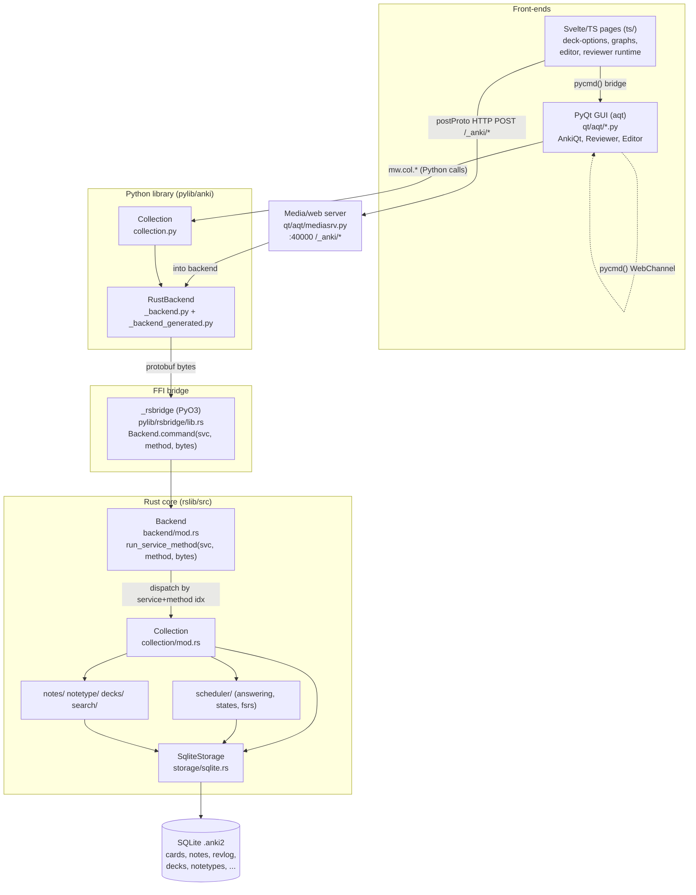

# Anki Desktop — Architecture Notes

> Onboarding guide for modifying the Anki desktop source in this repo.
> Everything below was read from the code in this checkout (commit on `main`).
> Where a claim is inferred rather than directly verified, it is marked **(inferred)**.

---

## 1. High-Level Architecture

Anki is a polyglot app with a **single Rust core** that owns all real logic and
the database, wrapped by two different front-ends (a PyQt desktop GUI and a
Svelte/TypeScript web layer embedded inside it). Protobuf is the contract that
ties every layer together.

| Layer | Lives in | Language | Responsibility |
|---|---|---|---|
| **Rust core** (`anki` crate) | `rslib/` | Rust | All business logic: collection lifecycle, data model, scheduler/FSRS, search, templates, media, sync, undo. Owns the SQLite DB. |
| **FFI bridge** | `pylib/rsbridge/` | Rust + PyO3 | In-process bridge exposing the Rust `Backend` to Python as the `_rsbridge` native module. |
| **Python library** (`anki`) | `pylib/anki/` | Python | Thin wrappers (`Collection`, `Note`, `Card`, managers) that serialize protobuf and call the backend. No scheduling logic of its own. |
| **PyQt GUI** (`aqt`) | `qt/aqt/` | Python + PyQt6/QtWebEngine | Desktop windows, the reviewer/editor, the embedded web server, the add-on system. |
| **Web frontend** | `ts/` | Svelte 5 + TS + Vite | Rich UI pages (deck options, graphs, editor, reviewer runtime, importers) rendered inside QtWebEngine. |
| **Protobuf contract** | `proto/anki/` | protobuf3 | Defines messages, the RPC services, and how some data is stored. Codegen feeds Rust, Python, and TS. |
| **Build system** | `build/`, `justfile`, `./ninja`, `./run` | Rust + ninja | A Rust `runner` generates a `build.ninja`, downloads toolchains (protoc, node, uv), and orchestrates all codegen + builds. |

### Three communication channels (important — they are *not* all the same)

1. **Python → Rust: in-process PyO3 FFI.** `_rsbridge.Backend.command(service, method, input_bytes) -> bytes`. Binary protobuf in, binary protobuf out. Verified in `pylib/rsbridge/lib.rs`.
2. **JS → Rust: HTTP POST.** Svelte pages call `postProto()` which POSTs binary protobuf to `http://127.0.0.1:40000/_anki/<method>`, served by the Python media server (`qt/aqt/mediasrv.py`), which forwards into the same Rust backend.
3. **JS → Python: Qt WebChannel bridge.** Embedded pages (reviewer, editor) call `pycmd("...")`, which reaches `onBridgeCmd` handlers in Python. Used for UI actions that Python must coordinate (e.g. committing a card answer in the desktop reviewer).



---

## 2. Tech Stack — what each piece is for

- **Rust core (`rslib/`)** — chosen so the same logic runs identically on desktop, AnkiMobile, AnkiDroid (via FFI) and AnkiWeb. All scheduling, search, templating, and DB access live here so the front-ends stay thin and consistent.
- **SQLite** — the collection is a single `.anki2` SQLite file. Opened in WAL mode with custom functions registered (`field_at_index`, `regexp`, `process_text`, `fnvhash`) — see `rslib/src/storage/sqlite.rs`.
- **Python (`pylib/`, `qt/`)** — historical language of Anki and of its huge add-on ecosystem. Kept as the GUI/automation layer; add-ons are Python.
- **PyO3 (`pylib/rsbridge`)** — lets Python load the Rust core as a native module in-process (no IPC), passing protobuf bytes.
- **Svelte 5 + SvelteKit + Vite (`ts/`)** — modern, reactive UI for complex screens (deck options, statistics graphs, editor) rendered in QtWebEngine. Talks to Rust over HTTP with binary protobuf.
- **Protobuf (`proto/`)** — single source of truth for the cross-language API and several stored data structures. Codegen produces matching Rust/Python/TS bindings.
- **FSRS** (`fsrs` crate, pinned in root `Cargo.toml`) — the modern spaced-repetition algorithm, integrated in `rslib/src/scheduler/fsrs/`.
- **Fluent (`ftl/`, `rslib/i18n`)** — Mozilla Fluent translation files; a build step generates type-safe translation accessors for Rust/Python/TS.

---

## 3. Entry Points & the modules you'll touch most

### App startup
```
just run
  └─ ./run                      # sets ANKI_API_PORT=40000, builds, then:
       └─ ./ninja pylib qt      # build via the Rust runner -> build.ninja
       └─ out/pyenv/bin/python tools/run.py
            └─ import aqt; aqt.run()        # qt/aqt/__init__.py
                 └─ _run()                   # parses args, ProfileManager, QApplication (AnkiApp)
                      └─ AnkiQt(...)          # qt/aqt/main.py  (the main window; global `mw`)
                           └─ loadProfile -> loadCollection -> _loadCollection
                                └─ self.col = Collection(path, backend=...)   # opens the Rust collection
                                └─ moveToState("deckBrowser")
```

### Modules you'll most likely edit
- **Scheduling / review behavior:** `rslib/src/scheduler/answering/`, `rslib/src/scheduler/states/`, `rslib/src/scheduler/fsrs/`.
- **Note/card creation & card generation:** `rslib/src/notes/mod.rs`, `rslib/src/notetype/mod.rs`.
- **Search syntax → SQL:** `rslib/src/search/parser.rs`, `rslib/src/search/sqlwriter.rs`.
- **DB schema & persistence:** `rslib/src/storage/**`, `rslib/src/storage/schema11.sql`, `rslib/src/storage/upgrades/`.
- **The API surface:** add/modify an RPC in `proto/anki/*.proto`, implement it in `rslib/src/**/service*.rs`.
- **Desktop UI:** `qt/aqt/main.py`, `qt/aqt/reviewer.py`, `qt/aqt/editor.py`, `qt/aqt/addcards.py`.
- **Web UI:** `ts/routes/**` (SvelteKit pages), `ts/editor/`, `ts/reviewer/`, `ts/lib/`.

---

## 4. Data Model

All IDs are newtypes over `i64` (millisecond timestamps), defined via the
`define_newtype!` macro (`rslib/src/types.rs`): `CardId`, `NoteId`, `DeckId`,
`NotetypeId`, `DeckConfigId`, `RevlogId`, and `Usn` (update-sequence number for sync).

### Card — `rslib/src/card/mod.rs` (struct `Card`, line ~76)
Key fields: `note_id`, `deck_id`, `template_idx`, `ctype` (`CardType`: New/Learn/Review/Relearn),
`queue` (`CardQueue`: New/Learn/Review/DayLearn/PreviewRepeat, plus negative
Suspended/SchedBuried/UserBuried), `due` (meaning depends on `queue`),
`interval`, `ease_factor`, `reps`, `lapses`, `remaining_steps`,
`original_due`/`original_deck_id` (for filtered decks), plus FSRS fields:
`memory_state: Option<FsrsMemoryState>` (`stability`, `difficulty`),
`desired_retention`, `decay`, `last_review_time`, and free-form `custom_data` (JSON).

### Note — `rslib/src/notes/mod.rs` (struct `Note`, line ~41)
`guid` (base91), `notetype_id`, `tags: Vec<String>`, `fields: Vec<String>`
(joined with the `\x1f` separator in the DB), cached `sort_field` and `checksum`
(used for duplicate detection; indexed as `ix_notes_csum`).

### Deck — `rslib/src/decks/mod.rs` (struct `Deck`)
`name: NativeDeckName` (hierarchy uses `::`), `kind: DeckKind` =
`Normal(NormalDeck { config_id, desired_retention, ... })` or
`Filtered(FilteredDeck { search_term, reschedule, ... })`.

### Notetype — `rslib/src/notetype/mod.rs` (struct `Notetype`)
`fields: Vec<NoteField>`, `templates: Vec<CardTemplate>` (front/back templates),
`config: NotetypeConfig` (e.g. `sort_field_idx`). This is what turns one note
into N cards.

### Review log — `rslib/src/revlog/mod.rs` (struct `RevlogEntry`)
One row per answer: `cid`, `button_chosen` (1–4), `interval`, `last_interval`,
`ease_factor` (stored ×10, e.g. 2500 = 250%), `taken_millis`, `review_kind`.

### Scheduling state machine — `rslib/src/scheduler/states/`
`CardState` = `Normal(NormalState)` | `Filtered(FilteredState)`, where
`NormalState` ∈ {New, Learning, Review, Relearning}. The state is *derived* from
the `Card` row, transitioned on answer, and written back.

### Storage / SQLite tables
Base schema `rslib/src/storage/schema11.sql`: **`col`** (1-row collection
metadata + JSON config), **`notes`**, **`cards`**, **`revlog`**, **`graves`**
(tombstones for sync). Later migrations in `rslib/src/storage/upgrades/`
(schema14/15/17/18) split the old JSON blobs out into real tables:
**`notetypes`**, **`fields`**, **`templates`**, **`decks`**, **`deck_config`**,
**`config`**, **`tags`**. The repo's current schema is **v18** (with v11
downgrade support for older clients). Key index for scheduling:
`ix_cards_sched ON cards(did, queue, due)`.

---

## 5. Inter-Layer Communication (the protobuf/FFI boundary)

### The contract: `proto/anki/*.proto`
~25 domain files. Each domain defines **two** services, e.g. in
`scheduler.proto`: `SchedulerService` (collection-bound methods) and
`BackendSchedulerService` (methods that don't need an open collection). Example:
```proto
service SchedulerService {
  rpc GetQueuedCards(GetQueuedCardsRequest) returns (QueuedCards);
  rpc AnswerCard(CardAnswer) returns (collection.OpChanges);
  ...
}
```

### How an RPC becomes a Rust call — verified in `rslib/rust_interface.rs`
Codegen emits a dispatcher on the `Backend`/`Collection`:
```rust
pub fn run_service_method(&self, service: u32, method: u32, input: &[u8])
    -> Result<Vec<u8>, Vec<u8>> {
    match service {
        N => self.run_scheduler_method(method, input),   // one arm per service
        ...
    }
}
// each run_<service>_method matches on `method`, decodes the request proto,
// calls the trait impl (e.g. SchedulerService::answer_card), encodes the response.
```
So every call is a **(service_index, method_index, bytes)** triple. Indices are
**assigned at build time** from the proto definitions and must match across Rust,
Python, and TS — they are *not* hand-written. (The exact numbers differ per
build; don't hardcode them.) Collection-bound methods are wrapped in
`with_col(...)`; errors are encoded as a `BackendError` protobuf
(`proto/anki/backend.proto`).

### Python side
- `pylib/rsbridge/lib.rs` — PyO3 `#[pyclass] Backend` with
  `command(service, method, input: bytes) -> bytes` (calls `run_service_method`)
  and `db_command(bytes)` (a separate JSON path for SQL via `DBProxy`, because
  Python protobuf is slow). `open_backend(init_bytes)` builds it.
- `out/pylib/anki/_backend_generated.py` — **generated** `RustBackendGenerated`
  with one snake_case method per RPC, e.g. `answer_card_raw(msg) -> self._run_command(svc, method, msg)`.
- `pylib/anki/_backend.py` — `RustBackend(RustBackendGenerated)` implements
  `_run_command` by calling `self._backend.command(...)` and maps `BackendError`
  kinds to Python exceptions (`errors.py`). Codegen lives in `rslib/proto/python.rs`.

### TS side
- `out/ts/lib/generated/backend.ts` — ~226 generated `async` functions
  (`answerCard`, `getCard`, …) using `@bufbuild/protobuf` messages.
- `ts/lib/.../post.ts` — `postProto(method, input, OutType)` POSTs binary
  protobuf to `/_anki/<method>` (content-type `application/binary`); the Vite dev
  proxy / the Python `mediasrv` routes it into the backend. Codegen: `rslib/proto/typescript.rs`.

---

## 6. End-to-End Traces

### A. Answer a card (desktop reviewer)
1. **JS:** user clicks an ease button in the reviewer page → `pycmd("ease2")`.
2. **Python (`qt/aqt/reviewer.py`):** WebChannel bridge → `Reviewer._linkHandler("ease2")` → `_answerCard(2)`. Builds a `CardAnswer` (next states come from the scheduler) and runs it through the **operations** framework: `aqt/operations/scheduling.py:answer_card(...)` → `CollectionOp(mw, lambda col: col.sched.answer_card(answer))` on a background thread.
3. **Python lib (`pylib/anki/scheduler/v3.py`):** `Scheduler.answer_card` → `backend.answer_card_raw(answer.SerializeToString())`.
4. **FFI:** `_rsbridge.Backend.command(scheduler_svc, answer_card_method, bytes)` → `run_service_method`.
5. **Rust (`rslib/src/scheduler/service/mod.rs`):** `SchedulerService::answer_card` converts the proto → `Collection::answer_card` (`rslib/src/scheduler/answering/mod.rs:311`).
6. **Rust core:** `Collection::transact(Op::AnswerCard, |col| col.answer_card_inner(answer))` (`answering/mod.rs:315`):
   - load card from `storage.get_card`; build a `card_state_updater`;
   - `require!` that the client's `current_state` matches (detects concurrent edits);
   - `updater.apply_study_state(current, new)` dispatches to `new.rs`/`learning.rs`/`review.rs`/`relearning.rs` (FSRS path in `scheduler/fsrs/` when enabled) and produces a partial revlog;
   - `add_partial_revlog`, `update_deck_stats_from_answer`, `maybe_bury_siblings`, then `update_card_inner` → `storage.update_card`; add leech tag if `new_state.leeched()`.
7. Returns `OpChanges` back up the chain; Python's `CollectionOp` success callback refreshes the UI and loads the next card.

> Note: the Svelte reviewer's `ts/reviewer/answering.ts` (`getSchedulingStatesWithContext` / `setSchedulingStates`, via `postProto`) is used to compute/preview next states and to let add-ons mutate them; the *commit* in the desktop app goes through the Python path above.

### B. Add a note (Add Cards dialog)
1. **Python UI (`qt/aqt/editor.py`):** field edits arrive as bridge commands `blur:<ord>:<nid>:<html>` → `Editor.onBridgeCmd` updates `note.fields`.
2. **(`qt/aqt/addcards.py`):** "Add" → `AddCards.add_current_note` → `_add_current_note` → `aqt/operations/note.py:add_note(...)` → `CollectionOp(parent, lambda col: col.add_note(note, target_deck_id))`.
3. **Python lib (`pylib/anki/collection.py`):** `Collection.add_note` fires the `note_will_be_added` hook, then `backend.add_note(note._to_backend_note(), deck_id)`.
4. **FFI → Rust (`rslib/src/notes/service.rs`):** `NotesService::add_note` → `Collection::add_note` (`rslib/src/notes/mod.rs:90`) → `transact(Op::AddNote, |col| col.add_note_inner(note, did))`.
5. **Rust core (`notes/mod.rs` `add_note_inner`):** load notetype; `canonify_note_tags`; `note.prepare_for_update` (normalize fields, compute `sort_field` + `checksum`); `storage.add_note` (`rslib/src/storage/note/mod.rs:72`, INSERT + `last_insert_rowid`); **generate cards** for each matching template → `storage.add_card`.
6. Returns `OpChanges` (with the new note id and card count); the dialog resets for the next note and fires `add_cards_did_add_note`.

---

## 7. Extension Points

- **Add a backend feature / new RPC:** add the message + rpc to the right
  `proto/anki/*.proto`, run a full `just check` (codegen), implement the trait
  method in `rslib/src/<domain>/service*.rs`, and it becomes available to Python
  (`col._backend.<method>`) and TS (`backend.ts`) automatically.
- **Change scheduling:** the cleanest seam is `rslib/src/scheduler/states/*` and
  `scheduler/answering/*`. FSRS-specific behavior is isolated in
  `scheduler/fsrs/`.
- **Add a web screen:** add a route under `ts/routes/<name>/` (SvelteKit), call
  backend RPCs through `@generated/backend`, and surface it from Python via the
  media server / a `webview.load_ts_page(...)` call.
- **Python add-on system (the main user-facing extension surface):**
  - Loaded by `qt/aqt/addons.py`; each add-on is a Python package whose
    `__init__.py` runs at startup.
  - **Hooks** are the supported API. Modern, typed hooks are generated into
    `out/qt/_aqt/hooks.py` and re-exported from `qt/aqt/gui_hooks.py`
    (e.g. `gui_hooks.reviewer_did_answer_card`, `collection_did_load`,
    `add_cards_did_add_note`); core/library hooks live in `pylib/anki/hooks.py`.
    Hook definitions are authored in `qt/tools/genhooks_gui.py` / `pylib/tools`.
  - Legacy dynamic hooks: `addHook`/`runHook`/`runFilter` in `anki/hooks.py`.
  - Add-ons typically wrap functions, subclass dialogs, register hooks, or add
    menu items off the global `mw` (`qt/aqt/main.py`).
- **`CollectionOp` / `QueryOp`** (`qt/aqt/operations/`) — the correct way to run
  collection mutations off the UI thread and get undo + UI-refresh handling for free.

---

## 8. Gotchas (read before changing code)

- **Generated files are not editable.** `out/pylib/anki/_backend_generated.py`,
  `out/ts/lib/generated/*`, Rust `OUT_DIR/backend.rs`, and `rslib/i18n/src/generated.rs`
  are all build artifacts. Edit the `.proto` / `.ftl` / codegen source instead and rebuild.
- **`.proto` changes need a full build.** `cargo check` alone won't regenerate the
  Python/TS bindings or the dispatcher — run `just check` (CLAUDE.md says the same).
- **Service/method indices are positional & cross-language.** Reordering RPCs in a
  proto service silently shifts indices for all three languages; only append, and
  rebuild everything together.
- **Two services per domain.** `FooService` vs `BackendFooService` — collection-bound
  vs backend-only. Put a method in the wrong one and `with_col` wiring won't match.
- **Three transports, easy to confuse.** Python↔Rust is in-process PyO3; JS↔Rust is
  HTTP protobuf to `:40000/_anki/*`; JS↔Python is the `pycmd` WebChannel bridge. The
  desktop reviewer uses the bridge to commit answers, *not* `postProto`.
- **Optimistic-concurrency on answers.** `answer_card_inner` `require!`s that the
  client's `current_state` equals the freshly computed state; if you change how
  states are derived, stale clients will get "card was modified" errors.
- **DB access from Python is JSON, not protobuf.** `db_command` exists because
  Python's protobuf is slow; raw SQL via `DBProxy` sets a "modified by dbproxy" flag
  (`CollectionState.modified_by_dbproxy`) so mtime gets bumped. Prefer backend methods
  over raw SQL.
- **Card `due` is overloaded.** Its meaning depends on `queue` (position for New,
  unix-seconds for Learn, days-since-creation for Review). See the `CardQueue` doc
  comments in `rslib/src/card/mod.rs`.
- **`ease_factor` storage units differ.** `Card.ease_factor` is a `u16` permille-ish
  value; `RevlogEntry.ease_factor` is stored ×10 (2500 = 250%). Don't mix them.
- **Use the Rust io/process helpers.** Per CLAUDE.md, prefer `rslib/io` and
  `rslib/process` over `std::fs`/`std::process` for better error context; in `rslib`
  use `error/mod.rs`'s `AnkiError`/`Result` + snafu.
- **Build is bespoke.** Don't call `./ninja`/`./run`/`tools/*` directly — go through
  `just` recipes. The Rust `runner` downloads pinned protoc/node/uv into `out/`.

---

## 9. Build & Dev Workflow (from `justfile`)

| Command | What it does |
|---|---|
| `just run` | Build `pylib`+`qt` and launch Anki in dev mode (`ANKIDEV=1`, web pages at `http://localhost:40000/_anki/pages/`). |
| `just run-optimized` | Same, release-optimized (`RELEASE=1`). |
| `just check` | Format + full build + all lints/tests (run this before marking work done). |
| `just web-watch` | Watch `ts/`, `sass/`, `qt/aqt/data/web/` and rebuild/reload the web stack live. `just rebuild-web` for one-off. |
| `just test` / `test-rust` / `test-py` / `test-ts` | Test suites (`check:rust_test` / `check:pytest` / `check:vitest`). |
| `just test-e2e` | Playwright browser tests in `ts/tests/e2e/` driving a temp Anki instance. |
| `just fmt` / `just fix-fmt` / `just fix-lint` | Formatting and lint autofix. |
| `just wheels` | Build Python wheels. |
| Quick iteration | `cargo check` (Rust), `just lint` (mypy/ruff + svelte/ts checks). |

Toolchains: Rust pinned by `rust-toolchain.toml`; Python via **uv** (`pyproject.toml`,
Python ≥3.12); JS via **yarn** (`package.json`). The build is bootstrapped by
`./ninja` → `build/runner` (Rust) → `build/ninja_gen` generates `build.ninja`.

---

## 10. Quick File Map

```
proto/anki/*.proto              API + storage contract (source of truth)
rslib/src/
  collection/mod.rs             Collection struct, open/build
  card/ note*/ decks/ notetype/ data model + structs
  scheduler/answering/mod.rs    answer_card / answer_card_inner
  scheduler/states/             New/Learning/Review/Relearning state machine
  scheduler/fsrs/               FSRS algorithm integration
  search/{parser,sqlwriter}.rs  search syntax -> SQL
  storage/sqlite.rs             SQLite open, pragmas, custom fns
  storage/schema11.sql + upgrades/  schema (current v18)
  backend/mod.rs                Backend struct, runtime, dispatch host
  rust_interface.rs             generates run_service_method dispatcher
pylib/rsbridge/lib.rs           PyO3 bridge: Backend.command(svc, method, bytes)
pylib/anki/
  _backend.py                   RustBackend, _run_command, error mapping
  collection.py                 Collection (add_note, get_card, find_*)
  scheduler/v3.py               Scheduler.answer_card
  cards.py notes.py decks.py models.py  data wrappers
qt/aqt/
  __init__.py                   run() / _run() startup
  main.py                       AnkiQt main window, moveToState, loadCollection
  reviewer.py                   reviewer, _answerCard, _linkHandler (pycmd)
  editor.py addcards.py         note editing/adding UI
  webview.py                    AnkiWebView + pycmd bridge
  mediasrv.py                   :40000 /_anki/* web + RPC server
  addons.py gui_hooks.py        add-on system + typed hooks
ts/
  routes/**                     SvelteKit pages (deck-options, graphs, card-info, importers)
  editor/ reviewer/ editable/   standalone bundles embedded in Qt
  lib/**                        shared components, i18n, postProto transport
build/, justfile, ./ninja, ./run   build system
```
