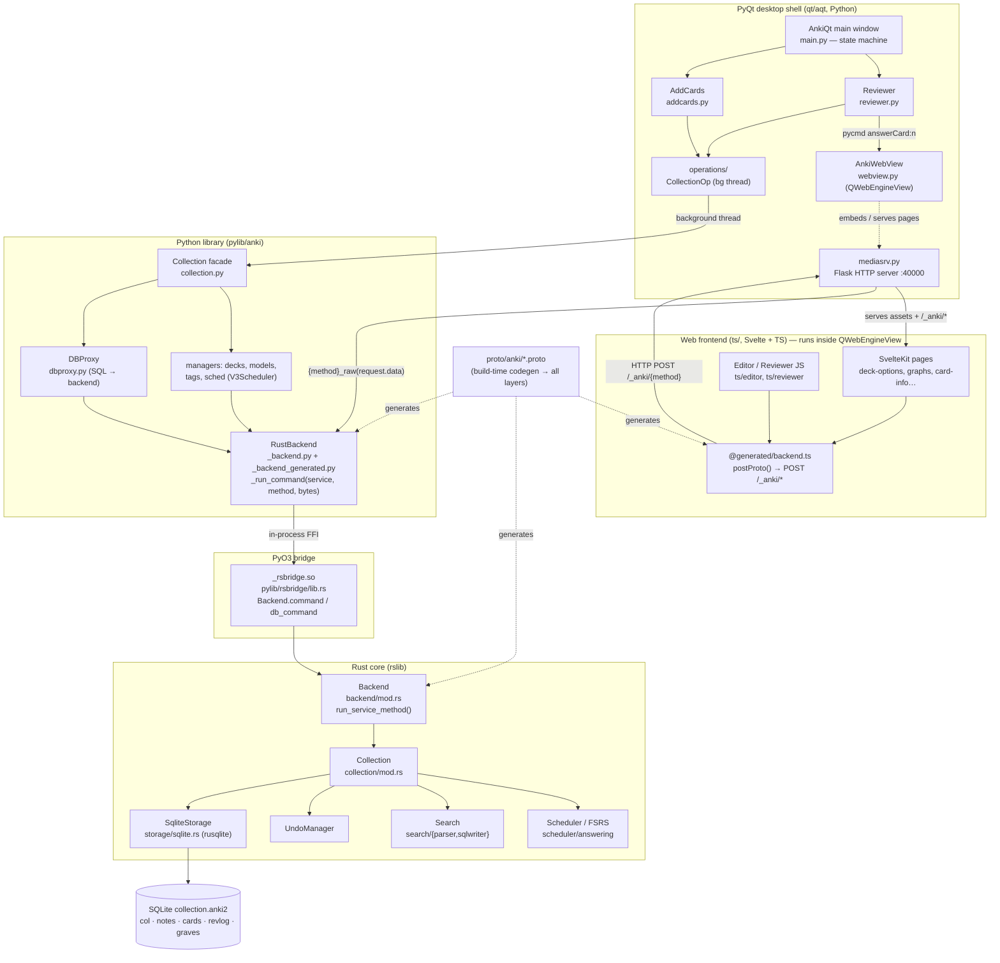

# Anki Desktop — Architecture Notes

> Onboarding map for the `ankitects/anki` desktop repo. Everything below was read out
> of this checkout (file:symbol citations throughout). Where I'm inferring rather than
> certain, it's flagged **(inferred)**.

---

## 1. High-level architecture

Anki is a **polyglot monorepo** with one authoritative core (Rust) and two clients (a
PyQt desktop shell, and a Svelte/TypeScript web UI embedded inside it). Protobuf is the
contract that ties all three languages together.

| Layer | Lives in | Language | Responsibility |
|---|---|---|---|
| **Rust core** | `rslib/` | Rust | The real app logic: collection, scheduler (FSRS), storage, search, sync, media, import/export, undo. Owns the **only** SQLite connection. |
| **PyO3 bridge** | `pylib/rsbridge/lib.rs` | Rust→Python | In-process FFI: exposes the Rust `Backend` as a Python native module `_rsbridge`. |
| **Python library** | `pylib/anki/` | Python | Thin, ergonomic facade over the Rust backend (`Collection`, `Card`, `Note`, managers). Legacy/add-on compatibility surface. |
| **PyQt GUI** | `qt/aqt/` | Python | The desktop app: window/state machine, dialogs, reviewer, editor, add-on host. Embeds web views. |
| **Web frontend** | `ts/` | TypeScript/Svelte | Rich UI pages (deck options, graphs, card info, editor, reviewer rendering) shown inside Qt web views. |
| **Local HTTP server** | `qt/aqt/mediasrv.py` | Python (Flask) | Serves the web assets to the embedded browser and forwards protobuf requests from JS to the Rust backend. |
| **Protobuf contract** | `proto/anki/*.proto` | proto3 | Defines every cross-language RPC + message. Code-generated into all three languages at build time. |

### Two distinct cross-language paths (the key mental model)

1. **Python → Rust = in-process FFI.** `col._backend.command(service, method, bytes)` →
   PyO3 → `Backend::run_service_method`. No network, shared memory, only protobuf
   (de)serialization cost.
2. **TypeScript → Rust = HTTP.** A Svelte page calls a generated async fn → `postProto`
   → `POST /_anki/<method>` (binary protobuf body) → Python **Flask** `mediasrv` →
   `col._backend.<method>_raw(bytes)` → (path 1) → Rust. So **JS reaches Rust *through*
   Python**, not directly.
3. **A third, older channel** exists for the Qt-hosted pages: a `pycmd()` JS bridge over
   `QWebChannel` (`qt/aqt/webview.py`) used for UI events like answering a card.

### Component / data-flow diagram



---

## 2. Tech stack & why each piece exists

- **Rust core (`rslib/`)** — Single source of truth for all logic so the desktop, mobile
  (AnkiDroid/iOS share this core via FFI — see `rslib/src/ankidroid/`), and sync server
  stay consistent. Fast, memory-safe, owns the DB.
- **SQLite via `rusqlite`** (`rslib/src/storage/sqlite.rs`) — The collection is a single
  `.anki2` SQLite file. Custom SQL functions (`field_at_index`, `process_text`, `regexp`,
  `fnvhash`) are registered on the connection for search/rendering.
- **PyO3** (`pylib/rsbridge/`) — Lets CPython call Rust in-process, so the mature Python
  GUI ecosystem (PyQt) drives the new Rust core without IPC overhead.
- **Python (`pylib/` + `qt/`)** — PyQt6 is a pragmatic, cross-platform desktop GUI
  toolkit; Python is also the historical add-on language, so a huge ecosystem depends on
  the `anki.*`/`aqt.*` APIs (hence the heavy deprecation-compat machinery).
- **Svelte + TypeScript (`ts/`)** — Modern, reactive UI for complex screens (deck options,
  stats graphs, editor) that would be painful in raw Qt widgets. Rendered in an embedded
  Chromium (`QWebEngineView`).
- **Protobuf** (`proto/anki/`) — One schema generates type-safe bindings for Rust, Python,
  and TS, guaranteeing the three layers agree on every message and RPC.
- **FSRS** (`fsrs` crate, `rslib/src/scheduler/fsrs/`) — The modern spaced-repetition
  algorithm (memory stability/difficulty), alongside the legacy SM-2 ease model.
- **Ninja + a Rust "configure" program** (`build/`) — Generates a `build.ninja` graph that
  orchestrates protoc, cargo, Python env, and yarn/vite builds with correct dependencies.
- **Fluent** (`ftl/`) — Translations; codegen produces type-safe i18n APIs for all three
  languages (`@generated/ftl` in TS, `_fluent.py` in Python).

---

## 3. Entry points & the modules you'll touch most

- **Desktop app start:** `qt/runanki.py` → `aqt.run()` → `aqt/__init__.py:_run()` →
  builds `ProfileManager`, the Rust backend, the `AnkiApp`, then `AnkiQt` (`qt/aqt/main.py`).
- **Main window & screen state machine:** `qt/aqt/main.py:AnkiQt` with
  `moveToState(...)` cycling `"deckBrowser" → "overview" → "review"` (handlers
  `_deckBrowserState`, `_overviewState`, `_reviewState`).
- **Collection lifecycle (Python):** `qt/aqt/main.py:AnkiQt.loadCollection()` opens
  `anki.collection.Collection`, which calls `self._backend.open_collection(...)`.
- **Rust collection construction:** `rslib/src/collection/mod.rs` — `CollectionBuilder` →
  `Collection` (holds `storage: SqliteStorage`, `tr: I18n`, undo/queue state).
- **Most-edited areas for feature work:**
  - Behavior/algorithm: `rslib/src/scheduler/`, `rslib/src/search/`, `rslib/src/notetype/`.
  - Desktop UX: `qt/aqt/reviewer.py`, `qt/aqt/editor.py`, `qt/aqt/browser/`, `qt/aqt/operations/`.
  - Web UI: `ts/routes/*`, `ts/lib/components/`, `ts/editor/`, `ts/reviewer/`.
  - Cross-layer API: add/modify an RPC in `proto/anki/*.proto` (then rebuild).

---

## 4. Data model

### SQLite schema (canonical) — `rslib/src/storage/schema11.sql`

Tables (schema is migrated up to **v18**; v11 is the base/downgrade target):

- **`col`** (single row): collection metadata — `crt` (creation), `mod`, `scm` (schema
  mod time), `ver`, `usn`, and JSON blobs `conf`, `models`, `decks`, `dconf`, `tags`.
  *(Legacy: note types/decks historically lived in these JSON blobs; modern code reads
  them via Rust types but the columns persist for compat.)*
- **`notes`**: `id, guid, mid` (notetype id), `mod, usn, tags, flds` (fields joined by
  `\x1f`), `sfld` (sort field), `csum` (checksum for dupe detection), `flags, data`.
- **`cards`**: `id, nid, did, ord` (template index), `mod, usn, type, queue, due, ivl,
  factor, reps, lapses, left, odue, odid, flags, data` (`data` is JSON holding FSRS state
  + `custom_data`).
- **`revlog`**: review history — `id` (ms timestamp), `cid, usn, ease, ivl, lastIvl,
  factor, time` (ms taken), `type`.
- **`graves`**: tombstones for sync — `usn, oid, type`.
- Indexes incl. `ix_cards_sched (did, queue, due)` (the scheduling hot path) and
  `ix_notes_csum` (duplicate detection).

### Core Rust types

- **`Card`** — `rslib/src/card/mod.rs:Card`. Key fields: `ctype: CardType`
  (`New=0, Learn=1, Review=2, Relearn=3`), `queue: CardQueue`
  (`New=0, Learn=1, Review=2, DayLearn=3, PreviewRepeat=4, Suspended=-1, SchedBuried=-2,
  UserBuried=-3`), `due: i32` (meaning depends on queue — new=position, learn=unix ts,
  review=days since creation), `interval`, `ease_factor` (SM-2, ×1000), `reps`, `lapses`,
  `remaining_steps`, and FSRS fields `memory_state: Option<FsrsMemoryState>{stability,
  difficulty}`, `desired_retention`, `decay`, plus `custom_data: String` (JSON exposed to
  the reviewer for add-on state).
- **`Note`** — `rslib/src/notes/mod.rs:Note`: `id, guid, notetype_id, tags: Vec<String>,
  fields: Vec<String>, mtime, usn`.
- **`Deck`** — `rslib/src/decks/mod.rs:Deck`: `id, name: NativeDeckName` (hierarchical via
  `::`), `kind: DeckKind` (`Normal` → has `config_id`, or `Filtered` → search/limits).
- **`DeckConfig`** — `rslib/src/deckconfig/mod.rs:DeckConfig` wraps `DeckConfigInner`
  (proto): learn/relearn steps, daily limits, ease/interval multipliers, leech threshold,
  FSRS params + `desired_retention`.
- **`Notetype`** — `rslib/src/notetype/mod.rs:Notetype`: `fields: Vec<NoteField>`,
  `templates: Vec<CardTemplate>`, `config` (CSS/LaTeX/card requirements). Determines how
  many cards a note generates and how they render.
- **`RevlogEntry`** — `rslib/src/revlog/mod.rs:RevlogEntry`: `button_chosen` (1–4),
  `interval`, `last_interval`, `ease_factor`, `taken_millis`, `review_kind`
  (`Learning/Review/Relearning/Filtered/Manual/Rescheduled`).

**Python mirrors** of these (`pylib/anki/cards.py:Card`, `notes.py:Note`,
`models.py:ModelManager`, `decks.py:DeckManager`) are thin wrappers around the protobuf
messages; constants in `pylib/anki/consts.py` (`CARD_TYPE_*`, `QUEUE_TYPE_*`,
`REVLOG_*`, `STARTING_FACTOR = 2500`).

---

## 5. Inter-layer communication (the protobuf/FFI boundary)

### The contract — `proto/anki/*.proto` (25 files)

- Each domain defines a service, often **two**: `XxxService` (collection-layer methods,
  e.g. `SchedulerService`) and `BackendXxxService` (backend-level, e.g.
  `BackendCollectionService.OpenCollection`). Example RPCs in
  `proto/anki/scheduler.proto`: `AnswerCard(CardAnswer) → OpChanges`, `GetQueuedCards`,
  `ComputeFsrsParams`, etc.
- Most mutating RPCs return `collection.OpChanges` (a bitmask of which UI areas changed —
  drives client refresh).

### Build-time codegen (one schema → three languages)

Driven by the `anki_proto` crate (`rslib/proto/`, `build.rs`) using **prost** + a
downloaded **protoc v31.1**, plus `anki_proto_gen` to read the descriptor set
(`out/rslib/proto/descriptors.bin`):

- **Rust:** service traits + a `run_service_method(service: u32, method: u32, &[u8])`
  dispatcher generated into `$OUT_DIR/backend.rs`, included by
  `rslib/src/services.rs` (`include!(concat!(env!("OUT_DIR"), "/backend.rs"))`). Trait impls
  live in `rslib/src/backend/*.rs`. Message structs via prost.
- **Python:** `out/pylib/anki/_backend_generated.py:RustBackendGenerated` — for every RPC a
  `foo_raw(bytes)→bytes` and a typed `foo(**kwargs)→Msg`, both calling
  `_run_command(service_idx, method_idx, bytes)`. Message types are `*_pb2.py`.
- **TypeScript:** `out/ts/lib/generated/backend.ts` — one async fn per RPC calling
  `postProto`. Messages via `@bufbuild/protoc-gen-es` into `out/ts/lib/generated/anki/*_pb`.

### Runtime path 1 — Python ↔ Rust (in-process, PyO3)

`pylib/rsbridge/lib.rs` exposes module `_rsbridge` with `open_backend(bytes) → Backend`
and methods `Backend.command(service, method, input) → bytes` (releases the GIL via
`py.detach`, calls `self.backend.run_service_method(...)`) and `Backend.db_command(bytes)`
(JSON, "due to Python's slow protobuf encoding/decoding").

Chain: `Collection.foo()` (`collection.py`) → `self._backend.foo()`
(`RustBackendGenerated`) → `_run_command(svc, mthd, bytes)` (`_backend.py:159`, also times
main-thread blocks) → `_rsbridge.Backend.command(...)` → Rust
`Backend::run_service_method` → trait impl on `Collection`/`Backend`.

> **Even raw SQL from Python goes through Rust.** `col.db` is a `DBProxy`
> (`pylib/anki/dbproxy.py`) whose `execute/all/scalar` call `backend.db_query(...)`. Python
> never opens its own SQLite handle — Rust owns the single connection.

### Runtime path 2 — TypeScript ↔ Rust (HTTP, via Python)

`out/ts/lib/generated/post.ts:postProto()` serializes the request and does
`fetch("/_anki/<method>", {method:"POST", "Content-Type":"application/binary", body})`.
In dev, `ts/vite.config.ts` proxies `/_anki` → `http://127.0.0.1:40000` (the running
Anki's mediasrv).

The server is the **Python Flask app** in `qt/aqt/mediasrv.py` (route
`@app.route("/<path:pathin>", methods=["GET","POST"])`). For backend RPCs it uses
`raw_backend_request(endpoint)` → `lambda: getattr(aqt.mw.col._backend,
f"{endpoint}_raw")(request.data)` — i.e. it pipes the raw protobuf bytes straight into
path 1. **Note the allowlist:** only methods in `mediasrv.py:exposed_backend_list` (plus
custom handlers in `post_handler_list`) are reachable over HTTP; the frontend does *not*
have blanket access to every RPC.

### Runtime path 3 — JS → Python UI bridge (`pycmd`)

For Qt-hosted pages (reviewer, deck browser), `qt/aqt/webview.py` injects a `QWebChannel`
bridge; JS calls `pycmd("answerCard:1")` → `AnkiWebView._onBridgeCmd` → fires
`gui_hooks.webview_did_receive_js_message` → page handler (e.g. `Reviewer._answerCard`).

---

## 6. Two real features traced end-to-end

### A) Answer a card

1. **Web/JS:** reviewer JS shows ease buttons; a click issues `pycmd("answerCard:<n>")`.
   (`ts/reviewer/` renders; the legacy reviewer page lives under `qt/aqt/data/web`.)
2. **Qt bridge:** `qt/aqt/webview.py:AnkiWebView._onBridgeCmd` → `qt/aqt/reviewer.py:
   Reviewer._answerCard(ease)` (fires `gui_hooks.reviewer_will_answer_card`, can veto).
3. **Build the answer:** `col.sched.build_answer(card, states, rating)` →
   `scheduler_pb2.CardAnswer` (`pylib/anki/scheduler/v3.py`).
4. **Run off the UI thread:** `qt/aqt/operations/scheduling.py:answer_card(...)` wrapped in
   a `CollectionOp` (`qt/aqt/operations/__init__.py`) → `.run_in_background()` via
   `taskman`. On success fires `gui_hooks.operation_did_execute` → reviewer shows next card.
5. **Python facade:** `V3Scheduler.answer_card` → `col._backend.answer_card_raw(bytes)` →
   `_run_command(13, 4, …)` *(verified: `SchedulerService` index 13, `AnswerCard` method 4)*.
6. **PyO3:** `_rsbridge.Backend.command(13, 4, bytes)` → `Backend::run_service_method`.
7. **Rust core:** `rslib/src/scheduler/answering/mod.rs:Collection::answer_card` →
   `self.transact(Op::AnswerCard, |col| col.answer_card_inner(answer))`
   (`rslib/src/collection/transact.rs` opens a DB transaction + undo step). Inside:
   - load card (`storage.get_card`), build a `CardStateUpdater`,
   - `apply_study_state(...)` → `apply_learning_state` / `apply_review_state`
     (`scheduler/answering/{learning,review}.rs`), consulting FSRS
     (`scheduler/fsrs/`) when enabled → produces a `RevlogEntryPartial`,
   - `add_partial_revlog(...)` → `storage.add_revlog_entry` (INSERT into `revlog`),
   - `update_card_inner(...)` → `storage.update_card` (UPDATE `cards`).
8. **Return:** `OpChanges` proto bubbles back up; Python/JS refresh accordingly.

### B) Add a note

1. **UI:** `qt/aqt/addcards.py:AddCards.add_current_note()` reads the note from
   `qt/aqt/editor.py:Editor` and the target deck from `DeckChooser`.
2. **Operation:** `qt/aqt/operations/note.py:add_note(...)` → `CollectionOp(lambda col:
   col.add_note(note, deck_id))` → background thread.
3. **Python facade:** `pylib/anki/collection.py:Collection.add_note` (line 532) fires
   `hooks.note_will_be_added`, calls `note._to_backend_note()`, then
   `self._backend.add_note(note=…, deck_id=…)` → `_run_command(25, 1, …)`
   *(verified: `NotesService` index 25, `AddNote` method 1)*.
4. **PyO3 → Rust:** `Backend::run_service_method` → `NotesService::add_note` impl on
   `Collection` (`rslib/src/notes/` + `rslib/src/backend/`). Rust inserts the note,
   **generates its cards from the notetype's templates**, writes rows, bumps `usn`, records
   an undo step.
5. **Return:** `AddNoteResponse` → Python sets `note.id`; `OpChanges` triggers UI refresh.

---

## 7. Build & dev workflow

> Per `CLAUDE.md`: use **`just`** recipes; don't call `./ninja`/`./run`/`tools/*` directly.

- **Build system:** `./ninja` builds a Rust `runner` (`build/runner/`) which runs a
  generated `out/build.ninja`. The graph itself is produced by `build/configure/` (Rust),
  using the `build/ninja_gen/` library — it wires up protoc download, cargo builds
  (`anki_proto`, `rsbridge`), Python env, and the yarn/vite web build with correct deps.
- **Run (dev):** `just run` → builds pylib+qt, launches Anki with `ANKIDEV=1`. Web pages
  are served at `http://localhost:40000/_anki/pages/…` (e.g. `deckconfig.html`); Qt remote
  debugging on `:8080`. `just run-optimized` for a release build.
- **Web hot-reload:** `just web-watch` (watches `ts/`, `sass/`, `qt/aqt/data/web/` and
  rebuilds/reloads); `just rebuild-web` for a one-off.
- **Checks:** `just check` (format + full build + lint + tests) — run before declaring done.
  Faster loops: `cargo check` (Rust), `just lint` (mypy/ruff + svelte/ts checks),
  `just wheels` (Python wheels). Formatting: `just fmt` / `just fix-fmt`; `just fix-lint`.
- **Tests:** `just test-rust`, `just test-py`, `just test-ts`; browser e2e via
  `just test-e2e` (Playwright/Chromium against a temp Anki instance, `ts/tests/e2e/`).
- **Proto changes need a full build** (`just check`) so codegen reruns across all layers.
- **Generated code lives in `out/`** (`out/pylib/anki`, `out/ts/lib/generated`,
  `out/rust`) — read-only, useful for understanding cross-language wiring. A startup guard
  in `_backend.py` aborts if `_rsbridge.buildhash() != anki.buildinfo.buildhash` (stale
  builds fail loudly).

---

## 8. Extension points

- **Python add-ons (the official plugin system):** `qt/aqt/addons.py:AddonManager`
  `__import__`s each enabled add-on package at startup. Add-ons extend behavior by
  appending to **hooks**, not subclassing.
  - GUI hooks: `qt/aqt/gui_hooks.py` (generated from `tools/genhooks_gui.py`) — e.g.
    `reviewer_will_answer_card`, `card_will_show`, `state_did_change`,
    `operation_did_execute`, `webview_will_set_content`.
  - Library hooks: `pylib/anki/hooks.py` + generated `out/pylib/anki/hooks_gen.py` — e.g.
    `note_will_be_added`, `card_did_render`. Legacy `addHook/runHook/wrap` still supported.
  - Add-ons can ship web assets via `mw.addonManager.setWebExports(...)` (served at
    `/_addons/<id>/...`).
- **Mutate scheduling from JS:** `ts/reviewer/answering.ts` exposes
  `globalThis.anki.mutateNextCardStates` (uses the whitelisted
  `getSchedulingStatesWithContext` / `setSchedulingStates` endpoints).
- **Cleanest places to change core behavior:**
  - Scheduling/algorithm → `rslib/src/scheduler/` (answering, FSRS, queue).
  - Search syntax → `rslib/src/search/parser.rs` + `sqlwriter.rs`.
  - Card rendering/templates → `rslib/src/template.rs`, `template_filters.rs`,
    `card_rendering/`.
  - New cross-layer capability → add an RPC to `proto/anki/<domain>.proto`, implement the
    trait in `rslib/src/backend/`/the domain module, rebuild; the Python/TS stubs appear
    automatically (expose to the web by adding to `mediasrv.py:exposed_backend_list`).
  - New web screen → add a route under `ts/routes/`, fetch via `@generated/backend`.

---

## 9. Gotchas / non-obvious things

- **Rust owns the only DB connection.** Python `col.db.execute(...)` is *not* local SQLite —
  it round-trips through `DBProxy` → `backend.db_query` (`pylib/anki/dbproxy.py`). Don't
  expect to open a second writer.
- **JS can't call Rust directly** — it goes JS → HTTP → Flask `mediasrv` → Python `_backend`
  → PyO3 → Rust, and only for **allowlisted** methods (`exposed_backend_list`). The
  protobuf service still defines hundreds of RPCs not reachable from the browser.
- **`db_command` uses JSON, not protobuf** (`rsbridge/lib.rs` comment) for speed — a
  deliberate asymmetry from the protobuf RPC path.
- **`due` is overloaded** — its meaning depends on `queue` (position / unix-ts / days). Same
  for `ease_factor` (SM-2 vs FSRS-derived encoding in `revlog`). Read
  `rslib/src/card/mod.rs` enum comments before touching scheduling.
- **Mutations must run off the UI thread** via `CollectionOp`/`QueryOp`
  (`qt/aqt/operations/`). Calling the collection directly from the GUI thread risks UI
  stalls (and `_backend.py` actively logs main-thread blocks > 200ms).
- **Two scheduler "versions" in Python:** only **V3** (`pylib/anki/scheduler/v3.py`) is the
  real one; `DummyScheduler` (`scheduler/dummy.py`) is a stub for the legacy v1 path. FSRS
  is layered on top of V3 in Rust.
- **`OpChanges` drives refresh.** If a new mutating RPC doesn't return/route the right
  `OpChanges` flags, the UI won't update even though the DB changed.
- **Heavy legacy-compat layer.** `pylib/anki/_legacy.py:DeprecatedNamesMixin` auto-maps old
  camelCase add-on calls to snake_case; lots of `flush()`-style methods are deprecated
  shims. Don't model new code on the legacy surface.
- **Don't hand-edit `out/`** — it's regenerated. Edit `proto/`, `rslib/`, etc. and rebuild.
  Generated `*_pb2.py`/`*_pb.ts`/`backend.rs` are derived artifacts.
- **`ftl/` strings are type-checked.** Add to `ftl/core` (or `ftl/qt` for Qt-only), then the
  codegen exposes them; missing/renamed keys break the build across languages.

---

## 10. Quick file index

| You want to… | Start here |
|---|---|
| Start the app | `qt/runanki.py`, `qt/aqt/__init__.py:_run`, `qt/aqt/main.py:AnkiQt` |
| Change reviewing | `qt/aqt/reviewer.py`, `rslib/src/scheduler/answering/mod.rs` |
| Change card scheduling/FSRS | `rslib/src/scheduler/` (esp. `fsrs/`, `states/`, `queue/`) |
| Change the editor / add-note UI | `qt/aqt/addcards.py`, `qt/aqt/editor.py`, `ts/editor/` |
| Add/modify an RPC | `proto/anki/<domain>.proto` → `rslib/src/backend/`/domain module |
| Python ↔ Rust glue | `pylib/anki/_backend.py`, `pylib/rsbridge/lib.rs` |
| TS ↔ Rust glue | `out/ts/lib/generated/{backend,post}.ts`, `qt/aqt/mediasrv.py` |
| DB schema / storage | `rslib/src/storage/schema11.sql`, `rslib/src/storage/` |
| Search | `rslib/src/search/{parser,sqlwriter}.rs` |
| Add-on hooks | `qt/aqt/gui_hooks.py`, `pylib/anki/hooks.py`, `qt/aqt/addons.py` |
| Build/dev commands | `justfile`, `build/configure/`, `build/ninja_gen/` |
```
