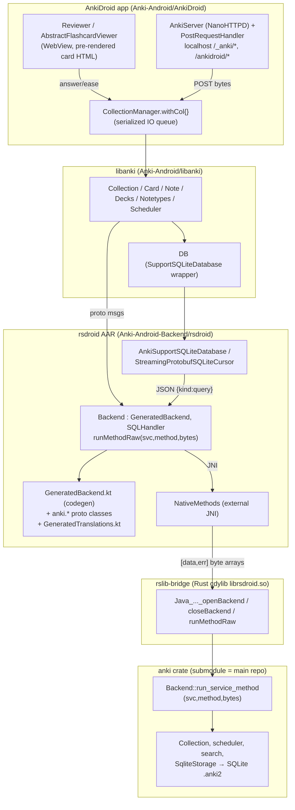

# AnkiDroid + Anki-Android-Backend — Architecture Notes (for porting Android into the main Anki repo)

> Reconstruction-level notes on how **AnkiDroid** (the Kotlin/Android app) and
> **Anki-Android-Backend** (`rsdroid`, the Rust→Android JNI bridge) work, and how
> they reuse the same Rust core as Anki Desktop. Goal: enough detail to rebuild
> the Android integration and to fold it into the main `ankitects/anki` monorepo.
>
> Sources: read directly from `/workspace/reference/Anki-Android` and
> `/workspace/reference/Anki-Android-Backend`. The bridge Rust, codegen, build
> orchestrator, JNI boundary, DB path, and translations were verified first-hand;
> Kotlin app/libanki details are from focused exploration and are cited by path.
> Inferences are marked **(inferred)**. Cross-reference with the desktop notes in
> `ARCHITECTURE_NOTES.md` — the Rust core is the *same code*.

---

## 0. The single most important fact

`Anki-Android-Backend` contains the Anki desktop repo as a **git submodule** at
`./anki/` (`.gitmodules` → `https://github.com/ankitects/anki`). The Android
backend does **not** fork or reimplement the Rust core — it builds the *same*
`anki` crate for Android/host targets and calls the *same* dispatcher:

```rust
backend.run_service_method(service, method, input_bytes) -> Result<Vec<u8>, Vec<u8>>
```

The only Android-specific Rust is a ~150-line JNI shim (`rslib-bridge/src/lib.rs`)
plus build-time Kotlin codegen. **Porting Android into the main repo therefore
means absorbing `rslib-bridge` + `build_rust` + the Kotlin/Fluent codegen as
workspace members alongside `pylib/rsbridge`, and pointing them at the in-tree
`rslib`/`proto` instead of the `anki/` submodule.** Everything else (the Kotlin
app, libanki) consumes the produced `.aar`/`.jar` and can stay in its own repo or
move too.

---

## 1. Two repos, layered

| Layer | Repo / dir | Language | Responsibility |
|---|---|---|---|
| **Rust core** (`anki` crate) | `Anki-Android-Backend/anki/rslib` (submodule = main repo) | Rust | Identical to desktop: collection, scheduler/FSRS, search, DB, templates, sync. |
| **JNI bridge** `rsdroid` (crate) | `Anki-Android-Backend/rslib-bridge/` | Rust + `jni` crate | `cdylib` exposing 3 JNI funcs; converts Java↔Rust; calls `run_service_method`. |
| **Build orchestrator** | `Anki-Android-Backend/build_rust/` | Rust | Runs the submodule's `ninja` for web assets + protoc/descriptors, cross-compiles the bridge with `cargo-ndk`, builds a host lib for tests, runs gradle. |
| **Kotlin backend lib** `rsdroid` (AAR) | `Anki-Android-Backend/rsdroid/` | Kotlin/Java | `Backend`, `NativeMethods`, generated `GeneratedBackend.kt` + proto classes, SQLite adaptor, translations. Published to Maven Central. |
| **Test lib** | `Anki-Android-Backend/rsdroid-testing/` | Kotlin/Java | Host-platform `.so/.dylib/.dll` inside a `.jar` + `RustBackendLoader` for Robolectric. |
| **libanki** | `Anki-Android/libanki/` | Kotlin | Port of desktop `pylib/anki`: `Collection`, `Card`, `Note`, `Decks`, `Notetypes`, `Scheduler`, `DB`, delegating to `Backend`. |
| **App** | `Anki-Android/AnkiDroid/` | Kotlin/Android | Activities, reviewer WebView, note editor, `CollectionManager`, the NanoHTTPD JS bridge, add-on-free. |
| **Public API** | `Anki-Android/api/` | Kotlin/Java | `ContentProvider`-based API (`FlashCardsContract`, `AddContentApi`) for third-party apps. |



---

## 2. The JNI boundary — `rslib-bridge/src/lib.rs` (verified)

A `cdylib` crate whose Cargo name is **`rsdroid`** (dir is `rslib-bridge`), so the
output is `librsdroid.so` / `.dylib` / `rsdroid.dll`. Depends on
`anki = { path = "../anki/rslib", features = ["rustls"] }` and `anki_proto`.

It exposes exactly **three** `#[no_mangle] extern "C"` functions, named for the
Kotlin class `net.ankiweb.rsdroid.NativeMethods`:

```rust
// openBackend(initBytes) -> [okBytes(Int64 ptr) | null, errBytes(BackendError) | null]
Java_net_ankiweb_rsdroid_NativeMethods_openBackend(env, _cls, args: JByteArray) -> JObject {
    logging::setup_logging();
    let input = env.convert_byte_array(args).unwrap();
    let result = init_backend(&input)                       // same fn as desktop rsbridge
        .map(|backend| {
            let ptr = Box::into_raw(Box::new(backend)) as i64; // leak Box, hand ptr to Java
            Int64 { val: ptr }.encode_to_vec()
        })
        .map_err(|err| BackendError { message: err, kind: InvalidInput as i32, ..default }
                         .encode_to_vec());
    pack_result(result, &mut env)
}

// closeBackend(ptr): reconstruct the Box and drop it
Java_..._closeBackend(_env, _cls, ptr: jlong) { drop(Box::from_raw(ptr as *mut Backend)); }

// runMethodRaw(ptr, service, method, argBytes) -> [okBytes | null, errBytes | null]
Java_..._runMethodRaw(env, _cls, ptr: jlong, service: jint, method: jint, args: JByteArray) -> JObject {
    let backend = &mut *(ptr as *mut Backend);
    let input = env.convert_byte_array(args).unwrap();
    with_packed_result(&mut env, || backend.run_service_method(service as u32, method as u32, &input))
}
```

Key mechanics to reproduce:

- **Return marshalling** `pack_result`: creates a Java `[[B` (2-element `byte[][]`)
  = `[okBytes | null, errBytes | null]`. The whole outer array is `null` only if
  allocation fails (OOM). This is the Android analogue of desktop returning
  `Result<Vec<u8>, Vec<u8>>` directly across PyO3.
- **Panic safety** `with_packed_result`: wraps the call in `catch_unwind`; a panic
  is converted by `panic_to_backend_error` into a `BackendError` with
  `kind = ANKIDROID_PANIC_ERROR` (so ACRA can capture a stack trace instead of a
  native crash). Desktop does not need this.
- **Backend handle = raw pointer as `jlong`.** One `Backend` per handle; one open
  collection per backend (same as desktop). No global state.
- **No `db_command` function.** Desktop's rsbridge has a separate `db_command`
  PyO3 method; Android does **not** — DB access is a normal service method (see §6).

`rslib-bridge/logging.rs` wires `android_logger`/`tracing`; `gag` is used to
suppress native stdout/stderr noise **(inferred from deps)**.

---

## 3. Code generation (build-time) — the Kotlin mirror of desktop's python.rs/typescript.rs

`rslib-bridge/build.rs` runs at crate-build time and drives all codegen:

```rust
let pool = DescriptorPool::decode(read(env DESCRIPTORS_BIN))?;   // compiled proto descriptors
let (_, services) = anki_proto_gen::get_services(&pool);         // SAME helper as desktop
proto::write_kotlin_interface(&services)?;                       // -> GeneratedBackend.kt
fluent::write_translations();                                    // -> GeneratedTranslations.kt
// + NDK x86_64 linker workaround (link clang_rt.builtins, see §5.4)
```

### 3.1 `GeneratedBackend.kt` — `rslib-bridge/proto.rs` (verified)

`write_kotlin_interface` emits an `abstract class GeneratedBackend` (package
`anki.backend`) with one abstract method:

```kotlin
protected abstract fun runMethodRaw(service: Int, method: Int, input: ByteArray): ByteArray
```

Then, for **every method of every backend service**, two functions:

```kotlin
// raw
fun getGraphPreferencesRaw(input: ByteArray): ByteArray = runMethodRaw(10, 2, input)   // service_idx, method_idx
// typed convenience
open fun getGraphPreferences(): anki.stats.GraphPreferences {
    val builder = anki.generic.Empty.newBuilder()
    val input = builder.build()
    return anki.stats.GraphPreferences.parseFrom(getGraphPreferencesRaw(input.toByteArray()))
}
```

Generation rules (mirror desktop exactly, just Kotlin syntax):
- `service.index` / `method.index` are the **same numeric indices** used by
  Python/TS and by `run_service_method`. Codegen never invents them.
- **Input destructuring**: if the input message name ends in `Request`, or has
  `<2` fields, and has no `oneof`/optional → expand into positional params and
  build the message inside; otherwise take the message directly. `List<>` params
  are widened to `Iterable<>`.
- **Output destructuring**: `anki.generic.Empty` → return `Unit`; a single
  non-enum field → return that field directly; else return the message.
- **Type mapping** (`kotlin_type`): int32/uint32→`Int`, int64/uint64→`Long`,
  bytes→`com.google.protobuf.ByteString`, message/enum→fully-qualified `anki.*`
  class, `repeated`→`List<>`, `map`→`Map<>`. Field named `val` → `` `val` ``.

Then `build_kotlin_protos` invokes **protoc** to generate the actual message
classes:

```
$PROTOC --kotlin_out=lite:$OUT --java_out=lite:$OUT -I ../anki/proto ../anki/proto/anki/*
```

So `anki.*` message/enum classes are **protobuf-lite** Java+Kotlin, generated at
build time (not hand-written, not vendored).

### 3.2 `GeneratedTranslations.kt` — `rslib-bridge/fluent.rs` (verified)

Reads `STRINGS_JSON` (`anki/out/strings.json`, produced by the anki i18n build)
and emits `interface GeneratedTranslations` (package `anki.i18n`) with:

```kotlin
fun translate(module: Int, translation: Int, args: TranslateArgMap): String   // abstract
// one typed method per Fluent string, e.g.:
fun statisticsReviews(reviews: Int): String =
    translate(<moduleIdx>, <translationIdx>, mapOf("reviews" to asTranslateArg(reviews)))
```

`asTranslateArg(Any)` boxes String/Int/Double into a `TranslateArgValue` proto.
Arg kinds map: `Int`→`Int`, `Float`→`Double`, `Any`→`TranslateArg`, else `String`.

---

## 4. The `rsdroid` Kotlin library (verified from source)

Package `net.ankiweb.rsdroid`, under `rsdroid/src/main/java/net/ankiweb/rsdroid/`.

### 4.1 `NativeMethods.kt` (18 lines, verified)
```kotlin
object NativeMethods {
    @CheckResult external fun runMethodRaw(backendPointer: Long, service: Int, method: Int, args: ByteArray): Array<ByteArray?>?
    @CheckResult external fun openBackend(data: ByteArray): Array<ByteArray?>?
    external fun closeBackend(backendPointer: Long)
}
```
The native lib is loaded with `System.loadLibrary("rsdroid")` — done by the app
(`AnkiDroidApp.makeBackendUsable()`) in production, and by `RustBackendLoader`
under Robolectric (§5.5).

### 4.2 `Backend.kt` (329 lines, verified) — the heart
```kotlin
open class Backend(langs: Iterable<String> = listOf("en"))
    : GeneratedBackend(), SQLHandler, Closeable {

    private var backendPointer: Long? = null
    val tr: Translations by lazy { Translations(this) }

    init {                                   // open the backend on construction
        val input = BackendInit.newBuilder().addAllPreferredLangs(langs).build().toByteArray()
        val outBytes = unpackResult(NativeMethods.openBackend(input))
        backendPointer = Int64.parseFrom(outBytes).`val`
    }

    // EVERY backend call flows through here:
    override fun runMethodRaw(service: Int, method: Int, input: ByteArray): ByteArray =
        withBackend { ptr -> unpackResult(NativeMethods.runMethodRaw(ptr, service, method, input)) }

    override fun close() { NativeMethods.closeBackend(backendPointer!!); backendPointer = null }
    fun openCollection(collectionPath: String) { /* derive .media + .media.db paths, call super */ }
}
```
- `unpackResult(Array<ByteArray?>?)`: throws `BackendException("null return…")` if
  outer array null; if `errorBytes != null`, parse `BackendError` proto and throw
  `BackendException.fromError(pbError)`; else return `successBytes`. (Verified.)
- `withBackend {}` throws `BackendException("Backend has been closed")` if pointer
  is null.
- `checkOperationsRunOnMainThread` (default false): debug aid that logs backend/SQL
  ops accidentally run on the UI thread.
- The desktop equivalent is `_backend.py`'s `RustBackend`; both subclass generated
  code and implement the single raw dispatch method.

### 4.3 `BackendFactory.kt` (verified)
```kotlin
object BackendFactory {
    var defaultLanguages: Iterable<String> = listOf("en")
    fun getBackend(languages: Iterable<String>? = null): Backend =
        backendForTesting?.invoke(languages ?: defaultLanguages) ?: Backend(languages ?: defaultLanguages)
    fun setOverride(creator: CustomBackendCreator?)   // tests inject a fake backend
}
```

### 4.4 Errors — `BackendException.kt` + `exceptions/` (verified layout)
`BackendException.fromError(BackendError)` maps the proto `kind` enum to typed
subclasses in `net.ankiweb.rsdroid.exceptions`: `BackendNotFoundException`,
`BackendInvalidInputException`, `BackendDeckIsFilteredException`,
`BackendExistingException`, `BackendIoException`, `BackendNetworkException`,
`BackendSyncException`, `BackendJsonException`, `BackendProtoException`,
`BackendTemplateException`, `BackendInterrupted…`, etc. A DB error becomes
`BackendException.BackendDbException`, and `Backend.openCollection` converts it to
a `SQLiteException` via `.toSQLiteException(...)`. Panics arrive as
`ANKIDROID_PANIC_ERROR` → surfaced as a fatal error (ACRA-reportable). This mirrors
desktop `errors.py`'s `backend_exception_to_pylib`.

### 4.5 `Translations.kt` (verified)
`class Translations(backend) : GeneratedTranslations` implements the abstract
`translate(module, translation, args)` by building a `TranslateStringRequest`
(module/message indices + arg map) and calling `backend.translateStringRaw(...)`
(an i18n-service RPC), then parsing the `generic.String` result. So all Kotlin
translation calls ultimately go through `runMethodRaw` too.

---

## 5. Database access over JNI (verified) — the part that differs most from desktop

Anki requires an **open collection to hold the SQLite lock**, so Java cannot open
the DB itself; all SQL must go through the Rust. AnkiDroid does this by
implementing Android's `androidx.sqlite` `SupportSQLite*` interfaces on top of the
backend, and routing SQL as **ordinary protobuf RPCs** — specifically the
`AnkidroidService` defined in `proto/anki/ankidroid.proto` (verified against the
main repo):

```proto
service AnkidroidService {
  rpc RunDbCommand(generic.Json) returns (generic.Json);
  rpc RunDbCommandProto(generic.Json) returns (DbResponse);
  rpc InsertForId(generic.Json) returns (generic.Int64);
  rpc RunDbCommandForRowCount(generic.Json) returns (generic.Int64);
  rpc FlushAllQueries(generic.Empty) returns (generic.Empty);
  rpc FlushQuery(generic.Int32) returns (generic.Empty);
  rpc GetNextResultPage(GetNextResultPageRequest) returns (DbResponse);
  rpc GetColumnNamesFromQuery(generic.String) returns (generic.StringList);
  rpc GetActiveSequenceNumbers(generic.Empty) returns (GetActiveSequenceNumbersResponse);
}
service BackendAnkidroidService {           // no open collection needed
  rpc SchedTimingTodayLegacy(...) returns (...);
  rpc SetPageSize(generic.Int64) returns (generic.Empty);
  rpc DebugProduceError(generic.String) returns (generic.Empty);
}
```

- The query payload is **JSON**, built by `Backend.dbRequestJson`:
  `{"kind":"query","sql":<sql>,"args":[...],"first_row_only":<bool>}` → `ByteString`.
  (Desktop uses the same JSON DB-command shape, but reaches it via a dedicated
  `db_command` FFI method; Android reuses the normal RPC dispatch.)
- `Backend` implements the `SQLHandler` interface (`database/SQLHandler.kt`):
  `fullQuery` (JSON rows), `fullQueryProto`/`getNextSlice` (streaming `DbResponse`),
  `insertForId`, `executeGetRowsAffected`, `getColumnNames`, `setPageSize`
  (default page 2 MB), `cancelCurrentProtoQuery`/`cancelAllProtoQueries`.
- **Streaming**: large results are paginated via `DbResponse { result, sequenceNumber,
  rowCount, startIndex }`; `StreamingProtobufSQLiteCursor` (in `database/`) pulls
  successive pages with `GetNextResultPage`. Results are buffered in Rust in a
  HashMap keyed by sequence number, so **nested streamed queries throw** (documented
  constraint). `closeCollection` calls `cancelAllProtoQueries()`.

The `androidx.sqlite` adaptor classes (`database/`): `AnkiSupportSQLiteDatabase`
(a `SupportSQLiteDatabase` + a `SupportSQLiteOpenHelper.Factory`),
`RustSupportSQLiteDatabase`, `RustSQLiteStatement`, `AnkiDatabaseCursor`,
`StreamingProtobufSQLiteCursor`. libanki's `DB` wraps one of these so existing
Kotlin code that runs raw SQL keeps working, now backed by Rust. The
`SqlValue`/`Row`/`DbResult`/`DbResponse` protos define the row encoding.

---

## 6. Build system (verified)

### 6.1 Entry points
- `build.sh` → `. ./set-android-ndk-home.sh` (sets `ANDROID_NDK_HOME` from
  `ANDROID_HOME` + the `ndk` version in `gradle/libs.versions.toml`) → `cargo run -p build_rust`.
- `build.bat` → `cargo run -p build_rust`.
- `build-rust.gradle` registers a `buildRust` Exec task (`cargo run -p build_rust`,
  with `RUNNING_FROM_GRADLE=1`); `rsdroid`'s `preBuild.dependsOn "buildRust"`.

### 6.2 `.cargo/config.toml` `[env]` — the contract the codegen reads (verified)
```toml
DESCRIPTORS_BIN       = "anki/out/rslib/proto/descriptors.bin"   # compiled proto descriptors
STRINGS_JSON_ANKIDROID= "anki/out/strings.json"                  # Fluent strings + indices
PROTOC                = "anki/out/extracted/protoc/bin/protoc"   # protoc binary
GENERATED_BACKEND_DIR = "rsdroid/build/generated/source/backend" # GeneratedBackend.kt etc.
```
All four are produced/located inside the `anki/` submodule's `out/` after its
ninja build. `build = { target-dir = "target" }` forces a fixed target dir the
gradle plugin expects.

### 6.3 `build_rust/src/main.rs` — orchestration order (verified)
1. **`build_web_artifacts()`** — runs the submodule's own `./ninja` with targets:
   `extract:protoc`, `css:_root-vars`, `ts:reviewer:reviewer.js|css`,
   `ts:reviewer:reviewer_extras_bundle.js|reviewer_extras.css`, `ts:mathjax`,
   `qt:aqt:data:web:js:vendor:mathjax`, `node_modules:jquery`, `sveltekit`.
   Copies results into `rsdroid/build/generated/anki_artifacts/backend/`
   (`sveltekit/` → renames `_app`→`app` because aapt ignores `_`-prefixed dirs;
   `js/`, `css/`, mathjax, jquery, license JSONs). Also parses **all `anki/ts`
   `.ts` + `.svelte` scripts with tree-sitter** (query
   `build_rust/tree_sitter_queries/ts_imports.scm`) to collect every backend
   function imported from `"@generated/backend"`, writing `ts_funcs.txt`. This is
   the allow-list of backend RPCs the web pages need exposed through the JS bridge.
2. **`build_android_jni()`** — `cargo install cargo-ndk@4.1.2`; `rustup target add`;
   then `cargo ndk -o rsdroid/build/generated/jniLibs -t <arch..> build -p rsdroid
   [--release]`. `CARGO_TARGET_DIR=target`; `STRINGS_JSON=<STRINGS_JSON_ANKIDROID>`;
   `RUSTFLAGS=-C link-args=-Wl,-z,max-page-size=16384` (16 KB pages for Android 15).
   Targets:
   - `ALL_ARCHS=1` → all four: `armv7-linux-androideabi`, `i686-linux-android`,
     `aarch64-linux-android`, `x86_64-linux-android`.
   - macOS/arm64 dev → `aarch64-linux-android` (`arm64-v8a`).
   - else → `x86_64-linux-android` (emulator).
3. **`build_robolectric_jni()`** — builds the bridge for the **host** platform into
   `rsdroid-testing/build/generated/jniLibs/`. `ALL_ARCHS` (macOS only) → build
   `x86_64/aarch64-apple-darwin` and `lipo`-merge into `librsdroid.dylib`, plus
   cross-build `x86_64-unknown-linux-gnu` (`librsdroid.so`) and
   `x86_64-pc-windows-gnu` (`rsdroid.dll`). `CARGO_TARGET_DIR=anki/out/rust`.
4. **`run_gradle()`** — unless `RUNNING_FROM_GRADLE`, run
   `./gradlew assembleRelease rsdroid-testing:build` with `RUNNING_FROM_BUILD_SCRIPT=1`
   (the reciprocal guard prevents cargo↔gradle recursion).

### 6.4 NDK x86_64 linker workaround (`rslib-bridge/build.rs`, verified)
For `x86_64-android`, recent NDKs need `clang_rt.builtins-x86_64-android`; build.rs
finds the NDK clang major version and emits
`cargo:rustc-link-search=…/lib/clang/<major>/lib/linux/` +
`cargo:rustc-link-lib=static=clang_rt.builtins-x86_64-android`.

### 6.5 AAR assembly — `rsdroid/build.gradle` (from build agent, cite)
- `com.android.library`, namespace `net.ankiweb.rsdroid`, `ndkVersion` from
  `libs.versions.toml` (`29.0.14206865`), `minSdk 23`, compile/target `36`.
- Source sets add generated dirs:
  `kotlin/java.srcDirs += build/generated/source/backend` (GeneratedBackend.kt,
  GeneratedTranslations.kt, `anki.*` classes); `jniLibs.srcDirs
  build/generated/jniLibs`; `assets.srcDirs build/generated/anki_artifacts`.
- `api libs.protobuf.kotlin.lite` (exposed to consumers so `anki.*` types are usable).
- `afterEvaluate` guard: the bundled AAR must contain ≥1 `.so` (and exactly 4 when
  `ALL_ARCHS=1`), else the build fails.
- Output `rsdroid/build/outputs/aar/rsdroid-release.aar`.

### 6.6 Test lib — `rsdroid-testing/` + `RustBackendLoader.kt` (from build agent)
- `java-library` + `kotlin`; packs host libs from `build/generated/jniLibs` as JAR
  resources (guard: ≥1, or exactly 3 for `ALL_ARCHS`). Output
  `rsdroid-testing/build/libs/rsdroid-testing.jar`.
- `RustBackendLoader.ensureSetup()` detects OS, extracts the right
  `librsdroid.{so,dylib,dll}` from the jar to a temp file (SHA-named to avoid
  collisions, cache-guarded, classloader-tolerant), and `Runtime.load()`s it — the
  Robolectric analogue of `System.loadLibrary`.
- `rsdroid-instrumented/` is a throwaway *application* module so instrumented tests
  can run against the library on a device/emulator.

### 6.7 Versioning / publishing
- `Anki-Android-Backend/gradle.properties`: `GROUP=io.github.david-allison`,
  `VERSION_NAME` of the form `<backendVersion>-anki<ankiDesktopVersion>` (e.g.
  `0.1.65-anki26.05b1`). Published to Sonatype/Maven Central as
  `io.github.david-allison:anki-android-backend` (+ `-testing`).
- The AAR embeds `BuildConfig` fields: `ANKI_COMMIT_HASH`, `ANKI_DESKTOP_VERSION`,
  `FSRS_VERSION`, `BACKEND_GIT_COMMIT_HASH`, `BACKEND_BUILD_TIME`.

---

## 7. libanki (Kotlin port of `pylib/anki`) — `Anki-Android/libanki/`

Package `com.ichi2.anki.libanki`. Delegates to `net.ankiweb.rsdroid.Backend`.
(Signatures below from focused exploration; treat exact arg lists as close but
verify against source when porting.)

- **`Collection`** (`Collection.kt`): holds `val backend: Backend`, `val db: DB`,
  and managers `decks: Decks`, `notetypes: Notetypes`, `config: Config`,
  `tags: Tags`, `sched: Scheduler`, `media`. `tr` = `backend.tr`. Opened via
  `Storage.collection(collectionFiles, databaseBuilder, backend)`; `init` calls
  `reopen()` (→ `backend.openCollection(path)`) then `_loadScheduler()`. Delegating
  methods: `addNote(note, did)`→`backend.addNote(note.toBackendNote(), did)`,
  `getCard`/`getNote`, `updateCard(s)`/`updateNote(s)`, `findCards/findNotes`
  (`backend.searchCards/searchNotes`), `undo/redo`, `syncCollection`, import/export.
- **`Storage`** (`Storage.kt`): `collection(...)` builds a `Backend` (via
  `BackendFactory.getBackend()` if not supplied) and a `Collection`; `openDB`
  builds the `DB` over the backend, initializing schema when the file is new.
- **`DB`** (`DB.kt`): thin wrapper over a `SupportSQLiteDatabase` (which is backed by
  the Rust SQLite adaptor from §5). `query`, `queryScalar`, `execute`, `insert`,
  `update`, `executeScript`. Legacy/raw-SQL escape hatch.
- **`Card`/`Note`** (`Card.kt`,`Note.kt`): mutable Kotlin objects that load from and
  serialize to the `anki.cards.Card` / `anki.notes.Note` protos
  (`toBackendCard()`/`toBackendNote()`, `loadFromBackend…`). `Card.render*` uses the
  template render context (backend card-rendering RPCs).
- **`Decks`/`Notetypes`/`Config`/`Tags`**: thin managers calling
  `backend.getDeckNames/addDeck/deckTree`, `backend.getNotetypeLegacy` (JSON via
  `ByteString`), `backend.getConfigJson/setConfigJson` (+ typed `ConfigKey` variants),
  `backend.allTags/tagTree/addNoteTags`, etc. Notetypes/decks/config are still
  JSON-shaped (`getNotetypeLegacy`/`getDeckLegacy`/`getConfigJson`).
- **`Scheduler`** (`sched/Scheduler.kt`): `card` getter →
  `backend.getQueuedCards(fetchLimit=1,…)`; `answerCard(card, rating)` →
  `backend.answerCard(buildAnswer(card, states, rating))`; `buildAnswer` builds a
  `CardAnswer` proto; plus `counts`, bury/suspend, `forgetCards`, `setDueDate`,
  `deckDueTree`, timing/stats.
- **Difference vs desktop pylib**: protobuf everywhere (not JSON) for cards/notes/
  scheduling; Kotlin coroutines + `@WorkerThread` discipline; typed wrapper classes;
  translations via `backend.tr`. Notetype/deck/config JSON is the remaining legacy
  seam.

---

## 8. AnkiDroid app — `Anki-Android/AnkiDroid/`

Package root `com.ichi2.anki`. (From focused exploration; cite before relying.)

- **`AnkiDroidApp`** (Application): `onCreate` → `System.loadLibrary("rsdroid")`
  (`makeBackendUsable`), subscribes to `ChangeManager` for `OpChanges`.
- **`CollectionManager`** (object): the single gateway. `withCol { … }` is a
  suspending function that serializes **all** collection access on one
  `Dispatchers.IO.limitedParallelism(1)` queue (a `ReentrantLock` under
  Robolectric). Owns the long-lived `Backend` (from `BackendFactory`), reopened only
  on language/schema change. `withOpenColOrNull`, `ensureOpen`. This is the app-level
  analogue of desktop's `CollectionOp`/main-thread discipline.
- **Reviewer**: `AbstractFlashcardViewer` (base) + `Reviewer`. The card is a
  **WebView** showing HTML that is **pre-rendered on the Kotlin side**
  (`AndroidCardRenderContext.renderCard` → `card.question(col)`/`card.answer(col)`
  which call the backend template renderer), wrapped in the static
  `assets/card_template.html`, with media filenames escaped and `[anki:play…]`
  expanded. Answering: `Reviewer` ease press → `AbstractFlashcardViewer.answerCard(rating)`
  → `answerCardInner` → `withCol { sched.answerCard(currentCard, rating) }` → next card.
- **JS ↔ backend bridge = local HTTP server** (the Android analogue of desktop
  `mediasrv`): `pages/AnkiServer` (extends **NanoHTTPD**, `fi.iki.elonen`) listens
  on `127.0.0.1:<port>`, POST-only, routing `/_anki/<method>` and `/ankidroid/<method>`
  and `/jsapi/…`. `pages/PostRequestHandler` maps method name → handler:
  `collectionMethods: Map<String, Collection.(ByteArray)->ByteArray>` (e.g. `graphs`,
  `getGraphPreferences`, `cardStats`, `i18nResources`, `getDeckNames`) and
  `uiMethods: Map<String, FragmentActivity.(ByteArray)->Deferred<ByteArray>>` (e.g.
  `updateDeckConfigs`, `importCsv`, `addImageOcclusionNote`, `searchInBrowser`).
  Requests/responses are binary protobuf, `application/binary` — identical wire
  contract to the desktop `/_anki/*` POST endpoint, so the *same* Svelte pages
  (deck-options, graphs, card-info, change-notetype, congrats, importers) run
  unmodified. Pages extend `pages/PageFragment`, which starts `AnkiServer` and loads
  `server.baseUrl()/<pagePath>` into a WebView. The `ts_funcs.txt` produced at build
  time (§6.3) is the source of which methods `PostRequestHandler` must expose.
- **Note editor**: `NoteEditorFragment` (fields + tags) → `saveNote()` →
  `undoableOp { col.addNote(note, deckId) }` (or `updateNote`).
- **`api/` module**: `FlashCardsContract` (a `ContentProvider` contract:
  `content://com.ichi2.anki/notes…`) + `AddContentApi` — the third-party integration
  surface, backed by `ContentResolver`. Published separately as
  `com.ichi2.anki:api`.
- **Web assets in the app**: `AnkiDroid/src/main/assets/` holds hand-maintained
  reviewer glue (`scripts/ankidroid-reviewer.js`, `card.js`, `js-api.js`),
  `card_template.html`, `flashcard.css`, MathJax, fonts. The *Svelte pages* come
  from the **backend AAR** assets (built by ninja in §6.3), not from here.

---

## 9. App build & module wiring — `Anki-Android/`

- **Modules** (`settings.gradle.kts`): `:AnkiDroid` (app; flavors `play`/`amazon`/
  `full`), `:libanki` (wraps backend AAR), `:api` (public, Java 11), `:common`
  (pure JVM), `:common:android`, `:compat`, `:anki-common` (shared Android glue),
  `:lint-rules`, `:vbpd` (vendored view-binding), `:baselineprofile`.
- **Depending on the backend** (`AnkiDroid/build.gradle` + `buildSrc/.../BackendDependencies.kt`):
  a `local_backend=true` line in `local.properties` switches between the published
  artifact and locally-built files:
  ```gradle
  // local_backend=true:
  implementation(files("../Anki-Android-Backend/rsdroid/build/outputs/aar/rsdroid-release.aar"))
  testImplementation(files("../Anki-Android-Backend/rsdroid-testing/build/libs/rsdroid-testing.jar"))
  // otherwise:
  implementation libs.ankiBackend.backend          // io.github.david-allison:anki-android-backend
  testImplementation libs.ankiBackend.testing       // …-testing
  ```
  The backend version is a single pin in `gradle/libs.versions.toml`
  (`ankiBackend = "0.1.64-anki25.09.2"` at time of reading) and **must match** the
  backend repo's `VERSION_NAME`.
- **Protobuf on the app side**: **no local codegen** — `anki.*` classes come
  transitively from the AAR; the app only adds the `protobuf-kotlin-lite` runtime
  (`4.34.1`). (`libanki`/`anki-common` add it via `addAnkiBackendDependencies()`.)
- Key versions (app): `compileSdk 36`, `minSdk 24` (app) / `16` (api), `targetSdk 35`,
  Kotlin `2.3.21`, AGP `9.0.1`, Robolectric `4.16.1`, JUnit 5. Tests run with
  `ANKI_TEST_MODE=1` and the `rsdroid-testing` jar. (The backend repo pins its own,
  slightly different versions — the two repos are independently versioned.)

---

## 10. End-to-end traces

**Answer a card**
1. Ease tap → `Reviewer`/`AbstractFlashcardViewer.answerCard(rating)` →
   `withCol { sched.answerCard(currentCard, rating) }`.
2. `libanki Scheduler.answerCard` → `backend.answerCard(CardAnswer proto)`.
3. `GeneratedBackend.answerCardRaw` → `runMethodRaw(schedulerSvc, answerCardMethod, bytes)`.
4. `Backend.runMethodRaw` → `NativeMethods.runMethodRaw(ptr,…)` → JNI
   `Java_..._runMethodRaw` → `backend.run_service_method(...)` →
   `SchedulerService::answer_card` → `Collection::answer_card_inner` (same Rust as
   desktop; writes card + revlog to SQLite).
5. `[okBytes,null]` → parsed `OpChanges`; `ChangeManager` refreshes UI; next card.

**Add a note**
`NoteEditorFragment.saveNote` → `undoableOp { col.addNote(note, deckId) }` →
`backend.addNote(note.toBackendNote(), deckId)` → `runMethodRaw(notesSvc, addNote)`
→ JNI → `NotesService::add_note` → `Collection::add_note_inner` (normalize, insert,
generate cards). Returns `OpChangesWithCount`; note id set back.

**Raw SQL (e.g. a legacy query in libanki `DB`)**
`DB.query(sql)` → `SupportSQLiteDatabase` adaptor → `Backend.fullQuery` →
`dbRequestJson {kind:"query",sql,args}` → `runDbCommand` (`AnkidroidService.RunDbCommand`)
→ `runMethodRaw(ankidroidSvc, runDbCommand)` → JNI → Rust DB proxy → JSON rows back.
Large result sets stream via `fullQueryProto`/`getNextSlice` + `DbResponse` pages.

**Render a Svelte page (e.g. deck options)**
`DeckOptions : PageFragment` starts `AnkiServer` (NanoHTTPD) and loads
`baseUrl()/deck-options/<id>` (assets from the backend AAR) in a WebView. The page's
JS POSTs protobuf to `/_anki/getDeckConfigsForUpdate` etc.; `AnkiServer` →
`PostRequestHandler.collectionMethods[...]` → `withCol { … }` → backend RPC →
protobuf response. Same wire protocol as desktop `mediasrv`.

---

## 11. Porting guide — folding Android into the main repo

What has to move / change (the seams):

1. **Bridge crate**: add `rslib-bridge` (crate `rsdroid`, `cdylib`) as a workspace
   member next to `pylib/rsbridge`, depending on the in-tree `rslib` + `rslib/proto`
   (drop the `../anki/...` submodule paths). Its 3 JNI functions + `pack_result` +
   panic handling are self-contained.
2. **Kotlin/Fluent codegen**: add the equivalent of `rslib-bridge/proto.rs`
   (`GeneratedBackend.kt`) and `fluent.rs` (`GeneratedTranslations.kt`) as another
   language target alongside the existing `rslib/proto/python.rs` and
   `typescript.rs`. They already consume `anki_proto_gen::get_services` and the
   `descriptors.bin` + `strings.json` the main build produces — so this is additive.
3. **Build orchestration**: port `build_rust` (cargo-ndk targets, RUSTFLAGS 16 KB,
   host build for Robolectric, web-asset copy from the existing ninja targets, the
   tree-sitter `ts_funcs.txt` step) into the main build system (a `just` recipe /
   ninja target). The web-asset ninja targets it calls (`ts:reviewer:*`, `sveltekit`,
   `ts:mathjax`, …) already exist in the main repo.
4. **`.cargo/config.toml [env]`** paths become in-tree (`out/rslib/proto/descriptors.bin`,
   `out/strings.json`, `out/extracted/protoc/bin/protoc`).
5. **Gradle projects** (`rsdroid`, `rsdroid-testing`, `rsdroid-instrumented`) and the
   AnkiDroid app + libanki either move into the repo or keep consuming a locally
   built AAR/JAR via the `local_backend` switch. The AAR packs jniLibs + generated
   sources + web assets; the testing jar packs the host lib + `RustBackendLoader`.
6. **Contract already shared**: `run_service_method`, all `proto/anki/*.proto`
   (including `ankidroid.proto` — already in the main repo), the protobuf indices,
   `BackendError`/`AnkidroidPanicError`, and the `/_anki/*` POST wire format are
   common to desktop and Android. No divergence to reconcile there.

---

## 12. Gotchas

- **Bridge crate name ≠ dir name**: dir `rslib-bridge`, Cargo package `rsdroid`,
  output `librsdroid.so`. JNI symbols are hard-coded to
  `net.ankiweb.rsdroid.NativeMethods` — the Kotlin class/package name must match
  the `#[no_mangle]` symbol exactly or `UnsatisfiedLinkError` at runtime.
- **Two-array return protocol**: `[okBytes|null, errBytes|null]`, outer null only on
  OOM. Any port must keep this exact shape (`unpackResult` depends on it).
- **Panics are data, not crashes**: caught and returned as `BackendError{kind:
  ANKIDROID_PANIC_ERROR}` so they show up as reportable errors, not SIGABRT.
- **DB lock ⇒ all SQL via Rust**: Java can't open the collection DB; everything goes
  through `AnkidroidService` RPCs. Nested streamed queries are unsupported (Rust
  buffers pages in a per-sequence HashMap) and throw.
- **16 KB page size**: `RUSTFLAGS=-C link-args=-Wl,-z,max-page-size=16384` is
  required for Android 15 devices; omit and the `.so` fails to load on 16 KB-page
  hardware.
- **x86_64 NDK linker**: needs the `clang_rt.builtins-x86_64-android` static lib
  workaround in `build.rs`.
- **Version coupling**: AnkiDroid's `ankiBackend` version must equal the backend
  repo's `VERSION_NAME` (`<backend>-anki<desktop>`); mismatched proto indices between
  a stale AAR and newer app code fail silently/at runtime.
- **`ALL_ARCHS` guards**: the AAR/JAR bundle tasks *fail the build* if the expected
  number of native libs (4 Android ABIs / 3 host platforms) isn't present — a good
  signal a cross-compile silently didn't run.
- **Cards are pre-rendered in Kotlin**, not served like desktop; only the richer
  Svelte pages use the NanoHTTPD server. Two different rendering paths coexist.
- **`_app` → `app` rename**: SvelteKit's `_app` dir must be renamed because Android
  aapt ignores `_`-prefixed asset dirs.
- **`cargo-ndk@4.1.2` is pinned in two places** (`build_rust/Cargo.toml` comment +
  `main.rs` install) — keep them in sync.

---

## 13. Key file map

```
Anki-Android-Backend/
  .gitmodules                     anki -> github.com/ankitects/anki (the main repo)
  .cargo/config.toml              [env] DESCRIPTORS_BIN / STRINGS_JSON / PROTOC / GENERATED_BACKEND_DIR
  build.sh / build.bat            -> cargo run -p build_rust
  build_rust/src/main.rs          orchestration: web assets, cargo-ndk, host lib, gradle
  build_rust/tree_sitter_queries/ts_imports.scm   extract @generated/backend imports -> ts_funcs.txt
  rslib-bridge/                   crate "rsdroid" (cdylib)
    src/lib.rs                    JNI: openBackend / closeBackend / runMethodRaw, pack_result, panic->err
    src/logging.rs                android_logger / tracing
    build.rs                      descriptors -> Kotlin iface + translations + NDK linker fix
    proto.rs                      GeneratedBackend.kt codegen + protoc kotlin/java (lite)
    fluent.rs                     GeneratedTranslations.kt codegen
  rsdroid/                        Android library (AAR)
    build.gradle                  packs jniLibs + generated sources + anki_artifacts assets
    src/main/java/net/ankiweb/rsdroid/
      NativeMethods.kt            external JNI decls
      Backend.kt                  Backend: GeneratedBackend, SQLHandler; runMethodRaw; unpackResult
      BackendFactory.kt           getBackend(langs); test override
      BackendException.kt + exceptions/   BackendError kind -> typed exceptions
      Translations.kt             translate() -> translateStringRaw (i18n RPC)
      database/                   SQLHandler, AnkiSupportSQLiteDatabase, RustSupportSQLiteDatabase,
                                  RustSQLiteStatement, AnkiDatabaseCursor, StreamingProtobufSQLiteCursor
  rsdroid-testing/                host-lib .jar + RustBackendLoader.kt (Robolectric)
  rsdroid-instrumented/           app module to run instrumented tests against the lib
  gradle.properties               GROUP=io.github.david-allison, VERSION_NAME=<backend>-anki<desktop>

Anki-Android/
  settings.gradle.kts             modules: AnkiDroid, libanki, api, common(:android), compat, anki-common, lint-rules, vbpd
  AnkiDroid/build.gradle          backend dep (+ local_backend switch), flavors play/amazon/full
  buildSrc/.../BackendDependencies.kt   AAR/JAR vs Maven artifact switch
  gradle/libs.versions.toml       ankiBackend=<ver>, protobuf-kotlin-lite, sdk/kotlin/agp versions
  libanki/src/main/java/com/ichi2/anki/libanki/
    Collection.kt Storage.kt DB.kt Card.kt Note.kt Decks.kt Notetypes.kt Config.kt Tags.kt
    sched/Scheduler.kt            answerCard/getQueuedCards/buildAnswer -> backend
  AnkiDroid/src/main/java/com/ichi2/anki/
    AnkiDroidApp.kt               loadLibrary("rsdroid")
    CollectionManager.kt          withCol{} serialized access, owns Backend
    AbstractFlashcardViewer.kt Reviewer.kt   WebView review, answerCard()
    AndroidCardRenderContext.kt   pre-render card HTML (backend template renderer)
    NoteEditorFragment.kt         add/edit note -> col.addNote/updateNote
    pages/AnkiServer.kt           NanoHTTPD localhost server (JS bridge)
    pages/PostRequestHandler.kt   /_anki/*, /ankidroid/* -> collectionMethods / uiMethods
    pages/PageFragment.kt         WebView host that starts AnkiServer
  api/                            FlashCardsContract, AddContentApi (ContentProvider API)
  AnkiDroid/src/main/assets/      card_template.html, scripts/*.js, flashcard.css, mathjax, fonts
```
