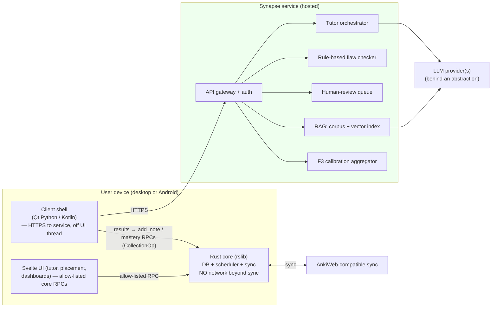

# Synapse — Grounded-AI Service Layer: Architecture & Design

**Status:** design proposal (M2) · Owner: e · Scope: DESIGN ONLY, no implementation
**Companion docs:** `notes/prd.md` (product spec), `notes/ARCHITECTURE.md` (desktop core), `notes/ARCHITECTURE_ANDROID.md` (mobile), roadmap `plans/velvet-brewing-cookie.md`.

> This document designs the **service layer** that the PRD repeatedly assumes but which does **not exist in Anki today** — Anki is local-first + sync, and the Rust core deliberately makes no LLM or network calls beyond sync. The service layer is where grounded generation (C1), the state-grounded tutor (C2), leech repair (C3), adaptive placement (D3), and the prediction services (F1–F3 rollups, calibration) live. It is introduced conceptually in M2 and built out across PRD Phases 2–4.
>
> **This is a design, not a decision.** For every consequential fork (topology, identity, provider) the document presents options with a recommendation and a trade-off table, then collects them in [§10 Open decisions for the owner](#10-open-decisions-for-the-owner). The owner makes the product/infra calls; engineering builds against them.

---

## 1. Design constraints (non-negotiable, from the architecture)

These are inherited from the verified architecture and the PRD's hard non-goals. Every option below is filtered through them.

1. **The Rust core makes no LLM/network calls beyond sync.** The core owns data, scheduling, search, and sync, and holds the *only* SQLite connection (`ARCHITECTURE.md §1`, §4). LLM calls, retrieval, IRT item-selection, and calibration are *orchestration with external I/O* — explicitly out of the core (`PRD §8`: "the core has no business making LLM network calls"; roadmap "keep the core free of network I/O").
2. **Generated content lands through normal RPCs and flows to mobile via sync.** Approved notes are written with `add_note` (`NotesService::add_note` → `Collection::add_note_inner`, `notes/mod.rs:90`), exactly as the Add Cards dialog does (`ARCHITECTURE.md §6.B`). The content then reaches AnkiDroid through the existing sync path — the mobile client is a **consumer of the shared core and synced content** (`ARCHITECTURE_ANDROID.md §0`, §11).
3. **The web UI can only reach allow-listed methods.** The Svelte pages POST protobuf to `/_anki/<method>` through the Flask `mediasrv`, and only methods in `mediasrv.py:exposed_backend_list` (+ `post_handler_list`) are reachable (`ARCHITECTURE.md §5`, §9). Any new page the service layer needs implies a small, explicit allow-list addition. **The service layer is a separate origin** — the CSP-style allow-list is about which *core RPCs* the browser may call, not about reaching the AI service (which the client reaches directly; see §2).
4. **Mobile has no add-ons and pre-renders cards.** AnkiDroid has no Python add-on surface; cards are pre-rendered in Kotlin, and only the richer Svelte pages use the NanoHTTPD local server (`ARCHITECTURE_ANDROID.md §8`, §12). So any client→service integration that must work on mobile **cannot** rely on the desktop add-on mechanism; it must be either (a) core-mediated + synced, or (b) a client-native network call the app makes itself.
5. **Proto is append-only and positionally indexed across four languages.** Service/method indices are positional; inserting or reordering silently breaks Python/TS/Kotlin (`ARCHITECTURE.md §5`, §9; `ARCHITECTURE_ANDROID.md §12` "mismatched proto indices fail silently"). New RPCs are **appended**, and `.proto`/`.ftl` changes require a full `just check` codegen. This constrains how much of the service integration can be pure-core vs. must live outside proto.
6. **No ungrounded AI. Ever.** PRD Principle 4 and §11 make ungrounded generation a **hard non-goal**. The service must be architecturally incapable of shipping a fact the model invented: grounding, the rule-based flaw check, and human review are gates, not suggestions (`PRD C1`).

The clean split the PRD already states (`§8`) and we adopt:

| Concern | Home | Why |
|---|---|---|
| Durable data, scheduling, per-concept read-models, sync | **Rust core (`rslib/`)** | Shared desktop+mobile via the JNI shim; owns the DB |
| LLM calls, RAG retrieval, IRT item-selection, calibration, human-review workflow | **Service layer (new)** | Needs network + orchestration the core forbids |
| Dashboards, tutor UI, placement flow, coverage report | **Shared web UI (`ts/`)** | Same Svelte pages run on desktop (Flask) and Android (NanoHTTPD) |

---

## 2. Topology — where the service runs and how clients reach it

**The fork.** The AI/orchestration work has to run *somewhere with network access*. Three shapes are possible, and they differ mainly in who bears the API cost, who holds the corpus, and how mobile is served.

### Option A — Local sidecar process (per-device)
A small local service (Python or Rust) launched alongside the desktop app, listening on `127.0.0.1:<port>`, doing retrieval + LLM calls itself.

- **Pro:** no hosting cost to us; user data never leaves the device except the LLM call; fastest to prototype on desktop (it can even be a bundled add-on that spawns a subprocess, per `ARCHITECTURE.md §8`).
- **Con:** **breaks on mobile** — AnkiDroid has no add-on/sidecar surface (`ARCHITECTURE_ANDROID.md §8`); the vetted corpus + embeddings index would have to ship to every device (large, hard to update, and it leaks the proprietary corpus); human review can't happen on-device; no central place to aggregate the F3 calibration dataset (`PRD F3`). Fails constraint #4 and the F3 requirement.

### Option B — Hosted cloud service (recommended)
A single Synapse-operated backend (HTTPS) that owns the vetted corpus + vector index, brokers LLM calls, runs the flaw checker, hosts the human-review queue, runs IRT placement item-selection, and aggregates calibration. Clients call it directly over HTTPS.

- **Pro:** corpus stays server-side (protects the "content track" asset, `roadmap` "content on a separate track"); one place for human review, monitoring, and the cross-user F3 calibration dataset; **same endpoint serves desktop and mobile identically**; model/prompt/corpus updates ship without a client release. Matches the roadmap's locked "hybrid backend" decision (`roadmap` "Decisions locked 2026-07-02").
- **Con:** we run infrastructure and pay per-token LLM costs; requires identity/auth (§3) and a privacy posture (§5.4); introduces a network dependency the base app never had — so it must be **strictly optional and degrade cleanly** (the MVP/M0–M1 loop must keep working with the service down).

### Option C — Bring-your-own-API-key (from the client)
The client holds the user's own LLM key and calls the provider directly; we ship only the corpus + prompts.

- **Pro:** zero LLM cost to us; appealing to power users.
- **Con:** same corpus-distribution and no-central-aggregation problems as A; the flaw-checker + human-review gate (the whole point of C1) can't be enforced client-side — a user with their own key can trivially bypass grounding, which **violates the hard non-goal (#6)**. Fatal for graded content. *Could* be offered later as an "unreviewed scratch draft" mode that is clearly not the trusted library, but that is a product decision with real risk.

### Recommendation
**Option B (hosted cloud service), with a hard rule that the base learning loop is service-independent.** It's the only topology that satisfies mobile parity (#4), protects the corpus, enforces the review gate (#6), and enables F3 aggregation. It matches the roadmap's already-locked hybrid decision.

| Topology | Corpus stays private | Works on mobile | Enforces review gate | F3 aggregation | Our infra/cost |
|---|:--:|:--:|:--:|:--:|:--:|
| A Local sidecar | ✗ (ships to device) | ✗ | ✗ (on-device) | ✗ | none |
| **B Hosted (rec.)** | ✓ | ✓ | ✓ | ✓ | yes |
| C BYO-key | ✗ | partial | ✗ | ✗ | none |

### How clients reach it (given the core avoids network)

The core does **not** proxy AI calls. Two directions of traffic, kept separate:

1. **Client → service (request):** the *client shell* (Qt Python on desktop, Kotlin on Android), not `rslib`, makes an HTTPS call to the Synapse service. On desktop this is a Python add-on / built-in module using `requests`/`aiohttp` off the UI thread (via `QueryOp`, `ARCHITECTURE.md §8`); on Android it is a Kotlin coroutine using the app's existing HTTP client. This keeps constraint #1 intact — **no network in `rslib`**.
2. **Service → collection (write-back):** the service does **not** get direct DB access. It returns structured results (drafted notes + citations, placement mastery, tutor turns) to the client, and the *client* commits them through the normal core RPCs (`add_note`, and the new mastery/lineage RPCs of §4) inside a `CollectionOp`. Content then syncs to other devices. This is the PRD's stated flow (`§8`: "write results back through normal RPCs").

> **Why not have the service talk to AnkiWeb sync directly?** It could (it would just be another sync client), and for *bulk* server-authored content that may be the right path later (see §4.5). But routing through the *user's client* for user-specific actions (mint-repair, placement) keeps the write inside the user's own undo/OpChanges/refresh machinery and avoids the service needing full collection-mutation rights. Start client-mediated; revisit a server-side sync writer only for bulk shared-deck publishing.

---

## 3. Identity & auth

The base app already has an identity system: **AnkiWeb-style sync accounts** (the `sync` proto + login flow). The question is whether the service reuses it or mints a new one.

### Option A — Reuse AnkiWeb-style sync accounts
The service trusts the same account the user syncs with; the client exchanges its sync session for a short-lived service token.

- **Pro:** one login; the account already keys the user's collection, so associating service state (placement results, calibration, review authorship) with "the same user whose cards these are" is natural.
- **Con:** couples the service's auth to the sync server's; if Synapse runs its **own** sync server (likely, since it's a fork) this is fine, but if it ever federates with public AnkiWeb it is not. Tokens must be scoped so the service can't act as a full sync client.

### Option B — New Synapse identity (recommended)
A dedicated Synapse account system (email/OAuth), issuing OIDC-style bearer tokens the service validates. Sync login can be linked to it, but they are separate subsystems.

- **Pro:** clean separation of concerns; the service can enforce its own consent/privacy terms (needed for the F3 cross-user dataset, §5); not hostage to sync-server auth internals; supports web-only surfaces (a reviewer console for human graders) that have no collection at all.
- **Con:** a second login unless we link them; more to build.

### Recommendation
**Option B, with account-linking to sync.** A first-class Synapse identity that the user links to their sync account on first use. This is the honest home for the consent gate the F3 dataset needs (§5.4) and for the human-review console, and it doesn't entangle AI auth with the DB/sync path. **Interim for the M2 prototype:** a single service-wide dev token is acceptable to exercise plumbing against the seed corpus (matches the roadmap's "engineering can build plumbing against the seed set"), but real per-user auth is required before any multi-user data (calibration) is collected.

**Request authentication (either option):** short-lived bearer token in the `Authorization` header on the HTTPS call the client shell makes; the service validates and derives `user_id`. **Per-user data** (placement history, tutor threads, this user's calibration contribution, review authorship) is keyed by `user_id` server-side; the *collection* itself never lives on the service — only derived/AI artifacts do (see §5). The mapping from a service `user_id` to the on-device collection is the client's responsibility; the service stores IDs and derived data, not `.anki2` files.

---

## 4. LLM + RAG pipeline (C1) and how content lands in the core

This section covers the generation pipeline (C1) and the mechanical integration back into the core; the tutor (C2), leech repair (C3), and placement (D3) reuse most of it and are detailed in §6/§7.

### 4.1 Provider choice & abstraction
- **Decision to defer to the owner:** which LLM provider(s). **Architecture recommendation regardless of choice:** put a **thin provider abstraction** (a `Generator` interface: `complete(messages, tools) -> text/toolcalls`, plus an `Embedder` interface) in front of the model so provider, model id, and prompt templates are config, not code. Reasons: (a) the PRD's own evidence is that model choice matters less than *grounding* (`C1`: constrained summarization ≈ 1.47% error vs adversarial 50–82% — the delta is the task, not the vendor); (b) we will want to A/B models and swap on price/quality; (c) the flaw-checker (below) is deliberately **rule-based, not another LLM**, so the model is only a drafting engine behind a gate.
- **Grounding is enforced in the prompt contract, not trusted to the model:** every generation call is *retrieval-augmented* — the prompt contains the retrieved source chunk(s), and the system instruction constrains the model to transform only that text (summarize *this* passage, write distractors from *this* answer key). A generation with no retrieved grounding is refused before it reaches the model. This is the architectural expression of the hard non-goal (#6).

### 4.2 The vetted-source corpus (the "content track" dependency)
The corpus is authored on a **separate, non-engineering track** (roadmap: "corpus + concept-graph authoring is non-engineering work done in parallel"). Engineering owns the *pipeline*, not the *content*. Corpus items are AAMC-aligned vetted source text, each tagged to one or more concept tags (`concept::<section>::<id>`, the M0/M1 convention) so retrieval can be concept-scoped and so a generated note's grounding maps to the same concept graph the rest of the app uses.

**Ingestion / chunking / embeddings / retrieval:**
- **Chunking:** semantic chunks sized to the model's context and to "one atomic fact per card" (the PRD's atomic-card goal, `C1`/`B1`). Each chunk carries: source id, citation metadata (title, section, page/paragraph anchor), and its concept tag(s).
- **Embeddings + index:** an embedding model (behind the `Embedder` abstraction) + a vector store (pgvector or a managed vector DB — an infra decision, §10). Because the corpus is small and curated (not web-scale), a simple hosted index suffices initially.
- **Retrieval:** concept-scoped hybrid retrieval — filter by the target concept tag(s) first (structured), then vector-rank within. Concept-scoping both improves precision and guarantees the grounding stays on-topic for the concept being generated for.

### 4.3 The quality gate: rule-based flaw check FIRST, then human-in-the-loop
The PRD is explicit and evidence-backed here (`C1`): a **rule-based item-writing checker catches ~91% of flaws vs ~79% for an LLM judge**, and AI MCQs carry higher rates of specific defects (multiple-correct answers, answer-giveaway distractors, ~4–5% vs ~1% human). So the gate order is deliberate:

1. **Grounding check (automated, hard fail):** the item must cite a retrieved chunk, and every factual claim must be attributable to grounding text. No citation → rejected, never queued.
2. **Rule-based item-flaw checker (automated, hard fail on structural defects):** classic item-writing rules — no multiple defensibly-correct options, no answer-giveaway/grammatical-cue distractors, no "all/none of the above" abuse, single clear stem, appropriate distractor plausibility. This runs **before** any human sees the item, so reviewers spend time on judgment, not on catching mechanical defects the checker already catches.
3. **Human expert review (required for graded content):** a human grader in a review console approves / edits / rejects. Only **approved** items become notes a learner sees. This is the human-in-the-loop the PRD requires and the enforcement point for the hard non-goal.

**Notably, an LLM is NOT used as the primary quality judge** (per the PRD's 91% vs 79% finding). An LLM *may* assist review as a triage signal, but it never replaces the rule-based checker or the human gate.

### 4.4 Citation / grounding storage on notes
Every AI item must carry its grounding citation, visible to the learner (`PRD C1`: "source citations on 100% of AI items"). Storage options:

| Option | Mechanism | Pro / Con |
|---|---|---|
| **A. Dedicated notetype field** (recommended) | Add a `Grounding` (citation) field to the MCAT notetypes (built *programmatically* via `col.models`, as M1 already builds notetypes — roadmap "build notetypes programmatically", avoiding the `StockKind` proto enum) | Visible on the card, syncs for free, no schema change, mobile-safe. Con: only as structured as a text field |
| B. `custom_data` on the card | JSON blob on the card | ~100-byte cap (roadmap: "keys ≤8 bytes") — too small for a real citation; already used for mint `{"src": nid}`. Reject for citations |
| C. Lineage table (see §4.6) | Row linking note → source chunk id | Queryable/auditable, but not shown on the card by itself; complements A |

**Recommendation:** **A (a `Grounding` field) as the user-visible citation**, backed by **C (lineage table row)** for auditability and residual-hallucination monitoring. The field renders on the card back; the table lets us later ask "which corpus chunk grounded this note, and did it get flagged?"

### 4.5 Residual-hallucination monitoring targets
Grounding reduces but never eliminates hallucination — "best clinical RAG configs still sit around 5–6%" (`PRD C1`). So the service ships with an **explicit monitoring target**, not a "solved" assumption:

- **Target:** post-review defect + residual-hallucination rate **at or below the human item-writer baseline** (~1% structural defects per the PRD's cited human rate). This is a *guardrail metric* in `PRD §7`.
- **Instrumentation:** sample approved items for periodic re-audit; track reviewer reject/edit rates as a leading indicator; log every generation's grounding chunk id (via §4.6) so a flagged item is traceable to its source. If residual defects exceed baseline, **generation stays gated harder** (more human review, lower auto-approve) rather than shipping — the PRD's stated fallback (`§10`).

### 4.6 How generated content lands in the core (write-back)
The service returns *drafts and approvals*; the **client commits** through core RPCs (constraint #2). Mechanically:

- **Content notes:** approved item → client builds a `Note` on the appropriate MCAT notetype (with the `Grounding` field populated) → `add_note` (existing RPC, `notes/mod.rs:90`) inside a `CollectionOp`. Card generation, concept-tag projection (`refresh_card_concepts_for_note`, `notes/mod.rs:389`), and sync all happen for free. **No new RPC is required to land content** — this is the single most important reuse in the design.
- **Grounding lineage:** to make the note↔source-chunk link queryable and auditable (beyond the visible field), M2 introduces a **local derived table** following the exact schema-19 concept-table pattern (see §5.3). Writing a lineage row *does* imply either a small new RPC or piggy-backing on the note-add path.
- **Bulk server-authored shared decks (future):** for a large vetted deck published to *all* users (the opt-in coverage deck, `PRD B4`), routing every note through every user's client is wrong. That is better published **once** as a shared deck (standard Anki import/export, `PRD B4`/`§8`) and distributed — either as a downloadable `.apkg` or via a server-side sync writer. Recommend: **client-mediated `add_note` for per-user AI actions** (mint-repair, placement-seeded cards), **shared-deck publishing for bulk corpus-wide content.** (Open decision, §10.)

### 4.7 New allow-listed RPCs / pages implied by C1
Generation itself needs **no** new core RPC (it reuses `add_note`). What C1 *does* imply:
- A **web page** for the review console *if* reviewers use the in-app UI (more likely a separate web app on the service — it has no collection). If any in-app surface shows "AI drafts pending", the read RPC it uses must be added to `exposed_backend_list`.
- The **grounding-lineage** read/write (§4.6, §5.3) is the one genuinely new core surface C1 adds, shared with B3 metamorphosis lineage.

---

## 5. Core integration, data placement & sync

This section maps each service feature onto the concrete core structures M0/M1 already shipped, then states what is local vs server vs synced.

### 5.1 How the tutor reads student state (C2)
The tutor needs the student's **mastery map** and recent history. Both already exist in queryable form:
- **Per-concept Memory** comes from `Collection::concept_memory` (`stats/concepts.rs`), which computes mean FSRS retrievability per `concept::<section>::<id>` from the derived `card_concepts`/`concepts` tables, with a `sufficient_data` threshold (≥3 scored cards). This is the ready-made mastery signal (`PRD F1`).
- **Recent revlog** (per-card answer history) is in the `revlog` table (`ARCHITECTURE.md §4`).
- **Prerequisite context** comes from the M2 `concept_edges` table (Workstream A / roadmap M2): the tutor surfaces the *unmastered prerequisite* behind a mistake (`PRD C2`: +2.7% from prerequisite surfacing).

**Flow:** on a miss, the client gathers (a) the just-answered card + its concept tag(s), (b) that concept's Memory + its prerequisites' Memory (a small read, possibly a new read-model RPC that returns "concept + its weak prerequisites"), and (c) the verified explanation for the item, then sends this bundle to the tutor endpoint. The service never queries the DB directly — the client packages the state (constraint #1). The tutor is **grounded in student state + the verified answer** (the C1 grounding principle applied to dialogue, `PRD C2`).

### 5.2 How placement seeds FSRS + per-concept mastery (D3)
Placement is a service that runs IRT item-selection (an ability estimate + a standard-error stopping rule, `PRD D3`) and returns, per confirmed concept, a mastery credit. The PRD's **critical rule: never credit mastery on a single correct answer** (`D3`, `D5`) — credit requires an application-level item, at least one spaced/delayed confirmation, and slip tolerance. Architecturally:

- The service returns per-concept results: `{concept_tag, credit_level}` where `credit_level ∈ {confirmed, partial, none}`.
- The **client applies** the credit through the core: crediting a concept sets the initial FSRS `memory_state` (stability/difficulty on `cards.data`, `ARCHITECTURE.md §4`) on that concept's cards — **confirmed** → long interval or a reversible suspend; **partial (borderline)** → a *shortened, nonzero* seed interval, not retirement (`PRD D3`/`D5`). This reuses the existing card + scheduler machinery rather than building a parallel one (`PRD §8`).
- Setting `memory_state` directly on cards implies a **new allow-listed RPC** (seed/override memory state for a set of cards, with the appropriate `OpChanges`), since no existing RPC exposes writing FSRS state as a placement seed. This is the main new *core* surface D3 adds. It belongs in the shared core so mobile placement works identically.

**Kill/adjust criterion carried from the PRD:** audit credited concepts against delayed confirmation; if >~10% fail, raise the bar (`PRD D3`).

### 5.3 How leech repair hooks the existing lapse path (C3)
Leech tagging already happens in the core's `answer_card_inner` when the lapse threshold trips (`ARCHITECTURE.md §6.A`; threshold configurable in `DeckConfig`). C3 lowers the intervention threshold and, on trigger, hands off to the service (`PRD C3`, roadmap M2). Two integration seams:

- **Detection seam (core):** the lapse/leech path emits a signal the client can observe. On **desktop** this is a `gui_hook` the add-on/built-in listens to (mint.py already uses `reviewer_did_answer_card`, `mint.py`); on **mobile** there is no add-on, so the equivalent is the client's own answer flow noticing the returned `OpChanges`/leech state. (A shared-core "early-lapse" flag surfaced in the answer result would give both platforms one seam — worth considering, but it is a scheduler change owned by Workstream A, flagged in §10.)
- **Repair seam (service + client):** on trigger the client sends the failing note + its concept + the collection's confusable siblings (found by searching the collection for near-duplicate notes — a client-side search) to the service, which (a) confirms the interfering sibling and (b) generates a grounded ~60-second worked-example micro-lesson (`PRD C3`). The atomized replacement cards go back via `add_note` (constraint #2). Repair is **teach-then-reschedule, never brute-force reschedule** (`PRD C3`).

### 5.4 Card metamorphosis lineage (B3) and the lineage table
B3 is **add-then-fade, never delete** (owner decision #3; `PRD B3`): once a concept's *application* form is mastered, its recall card fades to a long interval / reversible suspend, and the application item is added — recall is retired only after application mastery, with light maintenance retrieval kept before the exam. This needs a **queryable lineage table** (M0 stored `custom_data={"src": nid}`, ~100-byte cap, which the roadmap says M2 supersedes for queryability). This is a **local, derived, non-synced** table mirroring the schema-19 concept-table policy exactly:

- **Migration:** a new schema (schema-20, bumping `SCHEMA_MAX_VERSION` from 19; current value confirmed at `storage/upgrades/mod.rs:9`) adds a `card_lineage` table (e.g. `child_card_id`, `source_note_id`/`source_card_id`, `relation` ∈ {minted_from, application_of, grounded_by}, `created_secs`). The `grounded_by` relation absorbs the C1 grounding lineage of §4.6.
- **Downgrade = drop, rebuild on open:** the schema-20 downgrade **DROPS** `card_lineage` (mirroring `schema19_downgrade.sql`, which drops `concepts`/`card_concepts`), so the wire/on-disk schema-18 format is unchanged and full-sync upload / colpkg export stay compatible. On next open the table is repopulated from `custom_data` where present. This follows the M1 pattern the task mandates.

> **Why local/derived and not synced:** the same policy as concepts and edges — Synapse's added tables must not change the schema-18 sync format (task convention). Lineage is reconstructable from `custom_data` + notetype membership, so it is safe to drop-and-rebuild.

### 5.5 What is local vs server vs synced (summary)

| Data | Where it lives | Synced? | Notes |
|---|---|---|---|
| Cards, notes, revlog, scheduling state, `memory_state` | Core SQLite (`.anki2`) | **Yes** (schema-18 format) | The learning substrate; unchanged by Synapse |
| Concept tags `concept::…` | On notes | **Yes** | Source of truth for the concept layer (M0) |
| `concepts` / `card_concepts` (derived) | Core SQLite (schema-19) | **No** — drop on downgrade, rebuild on open | M1 pattern |
| `concept_edges` (prereq graph, M2) | Core SQLite (schema-20+) | **No** — same policy | Authored seed, resolved to concept ids (Workstream A) |
| `card_lineage` (mint/metamorphosis/grounding) | Core SQLite (schema-20) | **No** — drop/rebuild | §5.4 |
| Vetted corpus + embeddings index | **Service** | n/a | Proprietary; never on device (Option B) |
| Generated **approved** notes (with `Grounding` field) | Core SQLite → **synced** | **Yes** | Landed via `add_note`; the content itself is normal synced data |
| AI drafts pending review | **Service** | n/a | Never touch the collection until approved |
| Tutor threads / dialogue history | **Service** (per-user) | n/a | Not collection data; kept server-side for the tutor's grounding |
| Placement session history + IRT state | **Service** (per-user) | n/a | Only the *result* (mastery credit) lands in the core |
| F3 calibration dataset (predicted vs actual) | **Service** (aggregated, consented) | n/a | §5.6 |

### 5.6 The F3 calibration dataset (predicted-vs-actual), aggregated & private
Readiness (F3) improves by comparing the app's *predicted* score to *actual* AAMC scores users later report, building a proprietary calibration dataset (`PRD F3`). Architecture:
- **Contribution is per-user and consented.** A user opts in (the Synapse identity's consent gate, §3) to contribute `{predicted_range, actual_score, coverage, features}` when they report a real score.
- **Aggregation server-side, de-identified.** The service stores calibration tuples keyed by an opaque id, not by collection contents. Model refits run on the aggregate; improved calibration parameters ship back as service config — **no raw user collection ever leaves the device** (only the small predicted/actual tuple, with consent).
- **Privacy posture:** minimize what's sent (a tuple, not cards); explicit consent; right to withdraw; the F3 dataset is the *only* cross-user aggregation and is the reason the Synapse identity + consent gate exist (§3). This is a **product/legal decision** (§10) — engineering builds the consented, minimal-payload pipe; the owner sets the policy.

### 5.7 New allow-listed RPCs / pages implied (consolidated)
Appending RPCs is cheap but requires a full-build codegen and an `exposed_backend_list` entry to reach the web (`ARCHITECTURE.md §5`/§9). What M2's service integration implies:

| New core surface | Kind | Used by | Notes |
|---|---|---|---|
| `add_note` | **existing** | C1, C3, B1 | The content write-back path — reused, not new |
| Seed/override FSRS `memory_state` for cards | **new RPC** (append) | D3 placement | Sets partial/confirmed mastery; returns `OpChanges` |
| Read "concept + weak prerequisites" (mastery bundle) | **new read RPC** (append) | C2 tutor, D3, E1 "work on next" | Rolls up `concept_memory` + `concept_edges` |
| `card_lineage` read/write | **new** (table + RPC) | B3, B1, C1 grounding | Schema-20; drop-on-downgrade |
| Web pages: tutor panel, placement flow | **new SvelteKit routes** | C2, D3 | Register in `is_sveltekit_page`; any core RPC they call → `exposed_backend_list` |

Everything the *service itself* exposes (generate, tutor-turn, placement-next-item, calibration-submit) is **service HTTPS API**, not core proto — so it does **not** touch `exposed_backend_list` and does **not** require core codegen. This is the cleanest possible split: the AI surface evolves without touching the four-language proto contract.

---

## 6. Guardrails & quality gates

The PRD's guardrails are architectural requirements, not policies bolted on. Where each is *enforced*:

| Guardrail | PRD ref | Enforcement point (architectural) |
|---|---|---|
| **Grounded-only generation** | Principle 4, C1 | Prompt contract requires retrieved chunks; a generation with no grounding is refused *before* the model call (§4.1). The corpus lives only on the service (Option B), so there is no client path to ungrounded generation |
| **"No ungrounded AI" hard non-goal** | §11, Principle 4 | Because generation runs only on the hosted service behind the grounding + flaw + human gates, and clients cannot call the model directly (rejecting Option C for graded content), there is *no code path* that ships an ungrounded fact to a learner |
| **Rule-based flaw check before human** | C1 | Automated checker runs first; human reviews only what passes it (§4.3). LLM is explicitly *not* the primary judge (91% vs 79%) |
| **Human-in-the-loop for graded content** | C1 | Only human-approved items become `add_note` calls; drafts never touch the collection (§4.6, §5.5) |
| **Tutor answer-giveaway guardrail** | C2 | Prompt- and policy-level in the service: the tutor is grounded in the verified answer but instructed to Socratically surface the *prerequisite*, not reveal the answer (`PRD C2`). Enforced server-side (client can't loosen the system prompt); optionally a lightweight output check rejects turns that leak the answer key |
| **Residual-hallucination target** | C1, §7 | Explicit guardrail metric ≤ human baseline; sampled re-audit + reject/edit-rate monitoring; gate harder if exceeded (§4.5) |
| **Score abstention ("show nothing")** | F4, F5 | A single gate in the score read-model withholds any score with too-low coverage / too-wide interval / poor calibration (`PRD F4`) — a service-layer/read-model concern applied uniformly so no screen can bypass it |

**Cross-cutting principle:** the guardrails are strongest because generation is *centralized on the service* (Option B). A local or BYO-key topology (A/C) would move the gate onto the client, where it can be bypassed — which is exactly why those topologies fail the hard non-goal.

---

## 7. Phasing — build order mapped to PRD Phases 2–4

The service layer is introduced in **M2 = PRD Phase 2** and matures through Phases 3–4. Build order is dependency-driven, and each stage has a **kill/quality criterion** carried from the PRD so we don't ship a belief.

### Phase 2 (M2) — introduce the service; prove grounded generation
Order within the phase:
1. **Service skeleton + auth stub + corpus/RAG on the seed set.** Stand up Option-B service, the provider abstraction (§4.1), ingestion/chunking/embeddings over the *seed* corpus, concept-scoped retrieval. Dev token auth (§3 interim). *Prototype-first:* this validates retrieval quality before any generation. **Quality gate:** retrieval returns on-concept grounding for the seed concepts.
2. **Grounded generation + rule-based flaw checker + human-review console (C1).** The full C1 pipeline; approved notes land via `add_note` with a `Grounding` field. **Kill/quality criterion (PRD C1/§10):** post-review defect + residual-hallucination rate ≤ human baseline (~1%); 100% of AI items carry a citation. If residual defects exceed baseline, generation stays gated harder.
3. **`concept_edges` (prereq graph, D1) + gating & trickle-down (D2)** — core work (Workstream A), *read* by the service (tutor prerequisites, placement priors). **Criterion (PRD D2):** lower review load at equal mastery; higher success on newly unlocked items.
4. **Leech repair (C3)** — reuses generation; hooks the lapse path (§5.3). **Criterion (PRD C3):** lower eventual lapses + higher stability on repaired cards vs the default 8-lapse suspend.
5. **Placement (D3)** — once the graph exists; IRT item-selection in the service, mastery seeding via the new `memory_state` RPC (§5.2). **Kill criterion (PRD D3):** if >~10% of credited concepts fail delayed confirmation, raise the bar.
6. **Card lineage table + metamorphosis (B3)** — schema-20 `card_lineage`; add-then-fade (§5.4). **Criterion (PRD B3):** mastered concepts stay retrievable through test day while total reviews on them drop.

**What can be prototyped first (lowest risk, highest signal):** the **RAG-retrieval spike over the seed corpus (step 1)** — it needs no generation, no auth beyond a dev token, no core changes, and directly tests the thesis that concept-scoped grounding is precise. Second: **C1 generation into a review console** (step 2) end-to-end, because it exercises the whole gate + `add_note` write-back and produces the residual-defect number that governs everything downstream.

### Phase 3 (M3) — tutor, deadline scheduling, adoption, Performance
- **State-grounded tutor (C2)** — reuses the mastery-bundle read (§5.1) + verified-answer grounding; proactive at the moment of a miss (`PRD C2` adoption caveat). **Criterion:** unaided next-item correctness lift; engagement well above the ~15% Khanmigo floor.
- **Test-date governor (A2)**, **adoption mechanics (E2/E3)** — core/app work, behind A/B with the PRD's kill criteria (needs the M2 telemetry groundwork; roadmap A/B note).
- **Performance score (F2)** — a **prediction service** reading FSRS retrievability + application-item revlog + prerequisite mastery, returning a calibrated probability with an interval; **validate calibration (ECE/reliability), not just AUC, before surfacing** (`PRD F2`). **Criterion:** stated "70%" ≈ 70% observed on held-out application items; interval widens for untested concepts.

### Phase 4 (M4) — Readiness & the calibration dataset
- **Readiness projection (F3)** + the consented calibration dataset (§5.6); the full display + abstention contract (F4) across all three scores. **Criterion:** stated ranges contain actual scores at the stated rate; beat published third-party offsets on our own users; **abstain above ~515** until ≥2–3 AAMC-style full-lengths exist (`PRD F3`).

### Kill/quality criteria at a glance

| Stage | Feature | Kill / quality criterion (PRD) |
|---|---|---|
| P2 | C1 generation | defect+hallucination ≤ human baseline; 100% cited; else gate harder |
| P2 | C3 leech repair | fewer eventual lapses + higher stability vs 8-lapse suspend |
| P2 | D3 placement | ≤~10% of credited concepts fail delayed confirmation |
| P2 | B3 metamorphosis | no pre-exam decay on mastered concepts; fewer reviews |
| P3 | C2 tutor | unaided next-item lift; engagement ≫ 15% |
| P3 | A2 governor | cut if total workload rises or practice scores fall |
| P3 | E2/E3 adoption | revert if adherence / 4-week retention drops |
| P3 | F2 Performance | calibrated (ECE), not just AUC, before showing |
| P4 | F3 Readiness | ranges contain actuals at stated rate; abstain > ~515 |

---

## 8. End-to-end traces (how the pieces fit)

**A. Grounded generation → learner (C1).**
Corpus chunk (concept-tagged) → concept-scoped retrieval → RAG generation (provider abstraction) → grounding check → rule-based flaw checker → human-review console → *approved* → service returns draft to client → client `add_note` (with `Grounding` field) in a `CollectionOp` → card generation + `card_concepts` projection + `card_lineage` `grounded_by` row → sync → appears on desktop and Android.

**B. Miss → tutor (C2).**
Learner answers *Again* on an MCAT item → client captures the card + concept tag(s) → reads that concept's Memory + weak prerequisites (`concept_memory` + `concept_edges`) + the verified explanation → sends the bundle to the tutor endpoint → service runs the answer-giveaway-guardrailed Socratic prompt grounded in student state → returns turns → shown in the reviewer at the point of error. (Optionally: a follow-up mint via the existing B1 path.)

**C. Placement → seeded mastery (D3).**
Learner starts placement → service selects items (IRT, SE stopping rule) → learner answers → service returns per-concept `credit_level` (never on a single answer; application-level + spaced confirmation required) → client applies via the new `memory_state`-seed RPC (confirmed → long interval/suspend; partial → short seed interval) → scheduler picks up from there → syncs.

**D. Report a real score → better Readiness (F3).**
Consented learner enters an actual AAMC score → client sends `{predicted_range, actual, coverage}` tuple → service adds to the aggregated calibration dataset → periodic refit → improved calibration ships back as service config → future Readiness ranges tighten. No collection data leaves the device.

---

## 9. Risks specific to the service layer

- **Availability coupling:** the base loop must survive the service being down. Mitigation: the service is strictly additive; M0–M1 features (scheduling, mint, Memory dashboard) never call it. All service calls are best-effort with graceful "AI unavailable" states.
- **Cost/latency of LLM calls:** per-token cost and review-queue throughput bound how much content can be generated. Mitigation: small curated corpus, batch generation, cache by (chunk, prompt) — and the provider abstraction lets us swap on price.
- **Corpus dependency:** every C1/C3/D3 feature is gated by the parallel content track (roadmap open question). Engineering builds plumbing against the seed set; graded content ships only when the vetted corpus does.
- **Version coupling on mobile:** any new core RPC (§5.7) must land in a backend AAR that matches the app, or "mismatched proto indices fail silently" (`ARCHITECTURE_ANDROID.md §12`). Keep RPC additions append-only and coordinate the AAR bump.
- **Residual hallucination is never zero:** the monitoring target + hard-gate-on-exceed is the safeguard (§4.5); we treat it as a dial, not a solved problem (`PRD §10`).
- **Privacy/consent for F3:** the only cross-user data; mishandling it is both a legal and a trust risk. The consent gate + minimal payload + de-identification are the mitigations, but the *policy* is the owner's (§10).

---

## 10. Open decisions for the owner

These are the consequential product/infra forks this design deliberately does **not** decide. Ranked by how much they block the service layer.

1. **Topology (§2): hosted cloud service (recommended) vs local sidecar vs BYO-key.** Blocks everything — corpus hosting, mobile parity, the review gate, and F3 all depend on it. *Recommendation: hosted (Option B).* **Decide first.**
2. **Bulk content distribution (§4.6): client-mediated `add_note` for per-user AI actions + shared-deck publishing for the bulk coverage deck — or a server-side sync writer for everything?** Affects how corpus-wide vetted content reaches all users.
3. **Identity/auth (§3): new Synapse identity linked to sync (recommended) vs reuse sync accounts directly.** Blocks any multi-user data (F3) and the human-review console. *Recommendation: new identity, account-linked.*
4. **LLM provider(s) & embedding model (§4.1), and the vector store (§4.2).** Behind an abstraction so it's swappable, but a starting choice + budget is needed to prototype generation. (Cost model is a product input.)
5. **Human-review operations (§4.3): who reviews, at what throughput, in what console (separate web app vs in-app)?** Gates C1's launch; determines the auto-approve vs always-review policy that the residual-defect number feeds.
6. **F3 privacy/consent policy (§5.6): what tuple is collected, consent UX, retention, withdrawal, de-identification.** Legal + trust decision; engineering builds the consented minimal pipe once the policy exists.
7. **Residual-defect gating policy (§4.5): the numeric target and the auto-approve threshold** (start conservative; the PRD anchors ≤ human ~1% baseline). Tunable, but the owner sets the initial bar and the "gate harder" trigger.
8. **Early-lapse signal for C3 (§5.3): add a shared-core "early-lapse" flag to the answer result** (one seam for desktop + mobile) **vs per-platform detection.** A small scheduler change owned by Workstream A; affects whether leech repair is mobile-ready in M2 or desktop-only first.
9. **Abstention thresholds (F4/F5): interval-width / coverage cutoffs** for "show nothing." Start conservative; tune. (Owner sets the coverage/frustration trade-off dial.)

---

## Appendix — feature → service-layer component map

| PRD feature | Service component | Core surface it uses | New core work |
|---|---|---|---|
| C1 grounded generation | RAG + flaw checker + review queue | `add_note`; `Grounding` field | notetype field; `card_lineage` `grounded_by` |
| C2 state-grounded tutor | Tutor orchestrator (server-side guardrails) | `concept_memory`, `concept_edges`, revlog, explanation | mastery-bundle read RPC |
| C3 leech repair | Sibling-detection + micro-lesson generation | lapse/leech path; `add_note`; collection search | early-lapse seam (optional) |
| D3 placement | IRT item-selection + mastery crediting | seed FSRS `memory_state`; concept tables | `memory_state`-seed RPC |
| F1 Memory | (read-model, already core) | `concept_memory` | — (shipped M1) |
| F2 Performance | Prediction service (calibrated) | retrievability + application revlog + prereq mastery | read RPC for the score |
| F3 Readiness | Prediction + consented calibration aggregator | Performance rollup + reported actuals | calibration-submit (service-side) |
| B3 metamorphosis | (mastery-driven, mostly core) | FSRS interval growth + reversible suspend | `card_lineage` table (schema-20) |
| B4 coverage deck | Shared-deck publishing | import/export; coverage read-model | — (M1 checker shipped) |

*Prepared for M2. This document is design only; no code is changed. Every architectural claim is grounded in `notes/prd.md`, `notes/ARCHITECTURE.md`, `notes/ARCHITECTURE_ANDROID.md`, or the in-tree M0/M1 code cited inline.*
